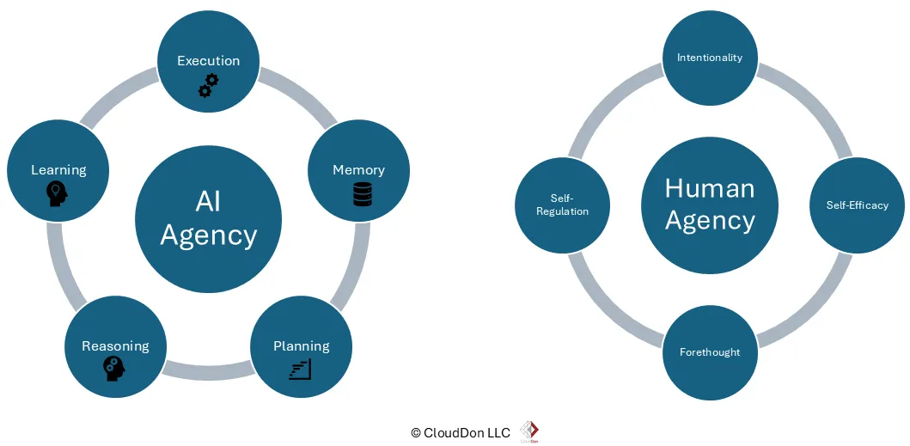
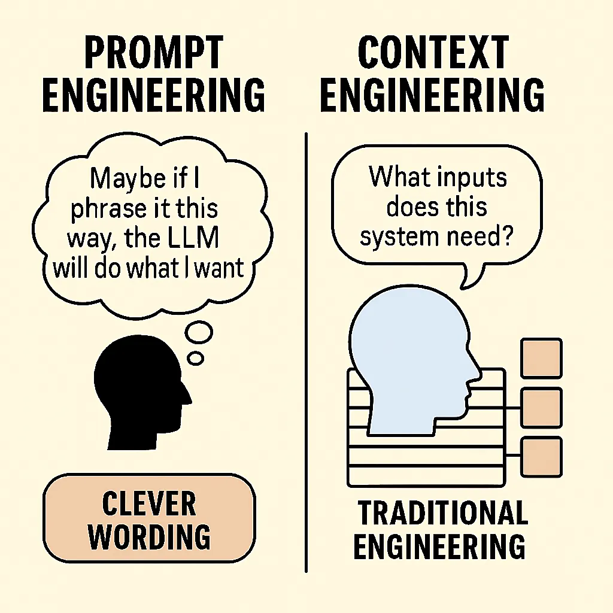

# AI-Assisted Development

Realita, Strategi, dan Praktik\
untuk Website Development yang Lebih Baik

<!--
TIMING: 2 menit

SPEAKER NOTES:
Sapa audiens. Jelaskan bahwa talk ini bukan tentang hype AI, tapi tentang realita penggunaan AI dalam website development sehari-hari.
"Di awal talk ini, saya akan melakukan sesuatu yang menarik — saya akan meminta AI untuk mengerjakan sebuah task di repository saya. Kita akan lihat hasilnya di akhir sesi."

DEMO START: Buka terminal, jalankan Claude Code, berikan prompt untuk mengerjakan sesuatu di repo ini (misalnya: menambahkan halaman baru, fix bug, atau improve existing feature). Biarkan berjalan di background selama presentasi.
-->

---

## 👋 Perkenalan


<https://www.zainfathoni.com/about>

- :round_pushpin: Jember :arrow_right: Bandung :arrow_right: :singapore: SG
  :arrow_right: Jogja
- :hammer_and_wrench: Backend :arrow_right: Manager :arrow_right: Frontend
  :arrow_right: Fullstack
- :robot: AI-Assisted Development Practitioner

---

## Agenda

1. **The Reality of AI-Assisted Development**
2. **Coverage & Control**
3. **Prompting & Interaction Strategy**
4. **Structured AI Coding**
5. **Maintaining Craftsmanship**
6. **Live Demo Results** :eyes:

---

## :clapper: Live Demo Setup

### Prompt AI di Awal, Cek Hasil di Akhir

```
"Buatkan slide presentasi untuk talk saya tentang
 AI-Assisted Development, lihat format slide yang
 sudah ada di repository ini."
```

:hourglass_flowing_sand: AI bekerja di background selama presentasi...

<!--
SPEAKER NOTES:
Ini adalah momen kunci. Tunjukkan ke audiens bahwa kamu sedang memulai sebuah AI task secara real-time.
"Saya akan meminta AI untuk mengerjakan sesuatu. Kita akan lihat hasilnya nanti di akhir. Ini adalah contoh nyata AI-assisted development — kita beri instruksi yang jelas, lalu biarkan AI bekerja."
-->

---

# 1) The Reality of AI-Assisted Development

---

## :robot: Peran AI di Setiap Fase Website Development

| Fase | Tools AI | Peran |
|------|---------|-------|
| :art: **Design** | v0, Figma AI | Prototyping UI |
| :computer: **Coding** | Claude Code, Copilot | Implementasi |
| :test_tube: **Testing** | Playwright MCP | Pengujian otomatis |
| :mag: **Review** | AI Code Review | Deteksi masalah |
| :rocket: **Deploy** | Vercel, CI/CD | Otomasi deployment |

<!--
SPEAKER NOTES:
Jelaskan bahwa AI bukan hanya tentang menulis kode. AI bisa membantu di setiap fase development.
Berikan contoh konkret di setiap fase. Misalnya: "Di fase design, v0 bisa generate UI dari deskripsi. Di fase coding, Claude Code bisa menulis implementasi. Di fase testing, Playwright MCP bisa membuat test otomatis."
-->

---

## :sparkles: Hype vs Reality

### Yang dijanjikan:

> "AI will replace developers"

### Kenyataannya:

- :white_check_mark: AI **mempercepat** pekerjaan repetitif
- :white_check_mark: AI **membantu** eksplorasi solusi
- :x: AI **belum bisa** menggantikan pemahaman arsitektur
- :x: AI **sering salah** di edge case dan konteks bisnis
- :x: AI **butuh arahan** yang jelas dari developer

<!--
SPEAKER NOTES:
Ini penting untuk set expectations. "AI bukan magic. AI adalah alat yang sangat powerful, tapi tetap butuh operator yang kompeten."
Berikan contoh nyata: "Saya pernah minta AI bikin fitur, hasilnya 80% benar. Tapi 20% sisanya — yang melibatkan edge case dan business logic — tetap harus saya review dan perbaiki."
-->

---

## :warning: Common Pitfalls

### Terlalu Bergantung pada AI-Generated Code

- :see_no_evil: **Copy-paste tanpa review** → bug tersembunyi
- :spaghetti: **Tidak ada arsitektur** → kode sulit di-maintain
- :lock: **Security blind spots** → vulnerability tidak terdeteksi
- :bomb: **Over-confidence** → "AI yang bikin, pasti benar"

<!--
SPEAKER NOTES:
Ceritakan contoh nyata kegagalan. Bisa pakai contoh dari slide sebelumnya tentang AI agent yang menghapus database.
"Masalah terbesar bukan AI-nya, tapi developer yang tidak melakukan verifikasi."
-->

---

## :bulb: Solusi & Strategi

- :shield: **Trust, but Verify** — selalu review output AI
- :test_tube: **Automated Testing** — biarkan mesin yang verifikasi
- :clipboard: **Spec-Driven Development** — mulai dari requirement yang jelas
- :brain: **Pahami kodenya** — jangan jadi "passenger" di kode sendiri

---

# 2) Coverage & Control

---

## :bar_chart: Coverage vs Control



### Coverage

Seberapa banyak AI digunakan dalam proses development

### Control

Seberapa besar kendali developer atas hasilnya

**Keduanya harus seimbang**

<!--
SPEAKER NOTES:
"Coverage tinggi tanpa control = chaos. Control tinggi tanpa coverage = lambat. Kunci-nya adalah menemukan keseimbangan yang tepat untuk setiap situasi."
-->

---

## :traffic_light: Level Kontrol Penggunaan AI

### 1. :green_circle: Assistive (Copilot)

AI menyarankan, developer memutuskan

### 2. :yellow_circle: Semi-Autonomous

AI mengerjakan task, developer me-review

### 3. :red_circle: Autonomous

AI mengerjakan end-to-end, developer hanya verifikasi akhir

<!--
SPEAKER NOTES:
"Kebanyakan dari kita berada di level 1-2. Level 3 hanya cocok untuk task yang sangat well-defined dan low-risk."
Berikan contoh untuk setiap level:
- Assistive: autocomplete, inline suggestions
- Semi-autonomous: "buatkan function X dengan spec Y", review hasilnya
- Autonomous: "buatkan halaman baru berdasarkan design ini" — hanya cek hasil akhir
-->

---

## :compass: Framework: Kapan & Seberapa Besar

| Situasi | Coverage | Control | Contoh |
|---------|----------|---------|--------|
| :art: Prototyping | :arrow_up: Tinggi | :arrow_down: Rendah | Bolt.new, v0 |
| :building_construction: Production | :left_right_arrow: Sedang | :arrow_up: Tinggi | Claude Code + Review |
| :lock: Security-critical | :arrow_down: Rendah | :arrow_up: Sangat Tinggi | Manual + AI assist |

<!--
SPEAKER NOTES:
"Framework ini membantu kita menentukan kapan boleh 'vibe coding' dan kapan harus disiplin. Prototyping? Silakan biarkan AI berkreasi. Production code? Review setiap baris."
-->

---

## :key: Ownership tetap di Developer

> "AI can accelerate development, but it cannot replace fundamental software
> engineering principles." — Addy Osmani

- :pilot: **Kamu tetap pilot-nya** — AI adalah co-pilot
- :brain: **Pahami arsitekturnya** — jangan serahkan sepenuhnya
- :white_check_mark: **Kamu yang bertanggung jawab** — bukan AI

---

# 3) Prompting & Interaction Strategy

---

## :keyboard: Prinsip Dasar Prompting

### Prompt yang Baik = Hasil yang Baik

- :dart: **Spesifik** — jelaskan apa yang dimau dengan detail
- :clipboard: **Berikan konteks** — file, framework, constraint
- :framed_picture: **Berikan contoh** — tunjukkan format output yang diharapkan
- :arrows_counterclockwise: **Iterasi** — perbaiki prompt berdasarkan hasil

<!--
SPEAKER NOTES:
"Prompting itu seperti memberi brief ke junior developer. Semakin jelas brief-nya, semakin bagus hasilnya."
Tunjukkan contoh prompt yang buruk vs bagus:
- Buruk: "Buatkan login page"
- Bagus: "Buatkan login page dengan React, menggunakan form validation, support dark mode, dan integrasi dengan API endpoint POST /auth/login"
-->

---

## :brain: Context Engineering > Prompt Engineering



Bukan hanya tentang **cara bertanya**,\
tapi **informasi apa yang tersedia**

- :keyboard: **User Input** — prompt kamu
- :books: **Retrieved Knowledge** — docs, CLAUDE.md
- :speech_balloon: **Prior Conversation** — konteks sebelumnya
- :hammer_and_wrench: **Tool Outputs** — hasil dari tools

<!--
SPEAKER NOTES:
"Context engineering adalah evolusi dari prompt engineering. Kita tidak hanya memikirkan cara bertanya, tapi juga memastikan AI punya semua konteks yang dibutuhkan."
Contoh: CLAUDE.md di repo ini berisi instruksi tentang tech stack, konvensi, dan cara development. AI membaca ini dan langsung paham konteksnya.
-->

---

## :busts_in_silhouette: Role-Based Interaction

### Gunakan AI Sesuai Perannya

**:building_construction: AI sebagai Architect**
"Desain arsitektur untuk fitur X dengan constraint Y"

**:computer: AI sebagai Implementer**
"Implementasikan function X sesuai spec ini"

**:mag: AI sebagai Reviewer**
"Review kode ini untuk security issues dan performance"

<!--
SPEAKER NOTES:
"Pendekatan role-based ini membantu AI fokus. Ketika kamu minta AI jadi architect, dia akan berpikir di level yang berbeda dibanding ketika diminta jadi implementer."
Demo: tunjukkan bagaimana prompt yang sama bisa menghasilkan output berbeda tergantung role yang diberikan.
-->

---

## :arrows_counterclockwise: Iterative Prompting

### Tingkatkan Kualitas Output Secara Bertahap

1. :one: **Prompt awal** — dapatkan draft pertama
2. :two: **Review & feedback** — identifikasi kekurangan
3. :three: **Refine prompt** — tambahkan constraint/context
4. :four: **Ulangi** sampai kualitas sesuai

:bulb: **Tips:** Gunakan `plan mode` untuk hemat token

<!--
SPEAKER NOTES:
"Jangan expect hasil sempurna di prompt pertama. AI-assisted development itu iteratif, seperti development biasa."
-->

---

## :scroll: Custom Rules & Instructions

### Jaga Konsistensi Output dengan CLAUDE.md

```markdown
# CLAUDE.md
## Git Conventions
- Do not include co-authorship in commit messages

## Architecture
- React Router v7 with file-based routing
- Tailwind CSS for styling
- TypeScript for type safety
```

:point_right: AI membaca ini dan mengikuti konvensi project

<!--
SPEAKER NOTES:
"CLAUDE.md adalah cara paling efektif untuk memberikan konteks persistent ke AI. Setiap kali AI membuka project, dia membaca file ini dan langsung paham konvensi-nya."
Tunjukkan CLAUDE.md dari repo ini sebagai contoh nyata.
-->

---

# 4) Structured AI Coding

---

## :ladder: Tahapan AI-Assisted Development

### Bukan langsung coding!

1. :clipboard: **Requirement** — apa yang mau dibangun?
2. :arrows_counterclockwise: **Flow** — bagaimana user menggunakannya?
3. :building_construction: **Architecture** — bagaimana strukturnya?
4. :computer: **Implementation** — baru mulai coding

<!--
SPEAKER NOTES:
"Kesalahan terbesar dalam AI-assisted development adalah langsung minta AI coding tanpa requirement yang jelas. Hasilnya? Kode yang 'works' tapi tidak sesuai kebutuhan."
-->

---

## :brain: The Fundamentals

### Why It Matters

- :zap: **Speed tanpa struktur = technical debt**
- :shield: **AI output tanpa review = liability**
- :chart_with_upwards_trend: **Structured approach = sustainable velocity**

### Core Principles

- :dart: Define before you build
- :test_tube: Test before you ship
- :eyes: Review before you merge

---

## :memo: Define with Structure

### Requirement → Flow → Architecture → Implementation

**Contoh dengan Kiro Specs:**

- :memo: **requirements.md** — EARS notation, testable requirements
- :art: **design.md** — Arsitektur teknis, data flow
- :clipboard: **tasks.md** — Rencana implementasi yang trackable

:point_right: AI bekerja lebih baik dengan spec yang terstruktur

<!--
SPEAKER NOTES:
"Ketika kamu memberikan AI sebuah spec yang terstruktur, hasilnya jauh lebih baik dibanding prompt yang ambiguous. Ini berlaku untuk semua AI tools."
-->

---

# 5) Maintaining Craftsmanship

---

## :gem: Menjaga Kualitas dalam AI-Assisted Coding

### Strategi Praktis

- :mag: **Review setiap output** — jangan auto-accept
- :test_tube: **Automated testing** — unit, integration, E2E
- :clipboard: **Code standards** — linting, formatting, type checking
- :busts_in_silhouette: **Peer review** — human eyes tetap penting

<!--
SPEAKER NOTES:
"AI bisa menulis kode yang 'works', tapi belum tentu kode yang 'good'. Tugas kita sebagai developer adalah memastikan kualitasnya."
-->

---

## :mag: AI-Assisted Code Review

### Deteksi Masalah dengan AI

- :nose: **Code smell** — duplicated logic, god functions
- :warning: **Anti-pattern** — circular dependencies, tight coupling
- :snail: **Inefficiency** — N+1 queries, unnecessary re-renders
- :lock: **Security issues** — injection, XSS, exposed secrets

<!--
SPEAKER NOTES:
"Gunakan AI untuk review kode — termasuk kode yang ditulis AI sendiri. Ini bukan ironi, ini strategi. AI bisa mendeteksi masalah yang kita lewatkan."
-->

---

## :lock: Security Awareness

### Developer sebagai Final Gatekeeper

- :shield: Validasi terhadap **vulnerability**
  - Injection, insecure API, dependency risk
- :no_entry: Jangan blindly trust AI untuk security
- :white_check_mark: **Checklist security** sebelum deploy
- :robot: Gunakan AI untuk **scan**, tapi verifikasi manual

<!--
SPEAKER NOTES:
"AI bisa membantu mendeteksi vulnerability, tapi jangan serahkan security sepenuhnya ke AI. Developer tetap harus jadi final gatekeeper."
-->

---

## :gear: System Thinking

### Menjaga Konsistensi Antar Modul

- :jigsaw: **Konsistensi** — patterns yang sama di seluruh codebase
- :no_entry: **Hindari "microservices effect"** — over-fragmentation
- :link: **Dependency awareness** — pahami impact perubahan
- :books: **Documentation** — AI bisa bantu generate, tapi review

<!--
SPEAKER NOTES:
"Ketika menggunakan AI di project besar, mudah sekali terjadi inkonsistensi. AI bisa menulis 10 function dengan 10 pattern berbeda jika kita tidak memberikan constraint. System thinking membantu kita menjaga kesatuan."
-->

---

## :white_check_mark: Practical Do's & Don'ts

| :white_check_mark: Do | :x: Don't |
|---|---|
| Review setiap output AI | Copy-paste tanpa baca |
| Berikan konteks yang lengkap | Prompt yang ambiguous |
| Test otomatis | "Works on my machine" |
| Iterasi bertahap | Expect sempurna sekali jadi |
| Pahami kode yang di-generate | Jadi "passenger" |
| Gunakan CLAUDE.md / rules | Mulai tanpa context |

---

# :eyes: Demo Results

---

## :trophy: Cek Hasil AI

### Apa yang terjadi selama kita presentasi?

:point_right: Mari kita lihat bersama...

<!--
SPEAKER NOTES:
Buka terminal, cek hasil dari AI task yang dimulai di awal presentasi.
Tunjukkan:
1. Apa yang diminta
2. Apa yang dihasilkan
3. Apakah hasilnya sesuai expectation
4. Apa yang perlu di-review/perbaiki

"Ini adalah contoh nyata AI-assisted development. AI mengerjakan task-nya, tapi kita tetap harus review hasilnya. Perhatikan — ada bagian yang bagus, dan mungkin ada bagian yang perlu diperbaiki. Itulah kenapa kita tetap harus jadi pilot."
-->

---

## :bulb: Key Takeaways

1. :robot: **AI adalah alat, bukan pengganti** — developer tetap pilot
2. :bar_chart: **Seimbangkan coverage & control** — sesuaikan dengan stakes
3. :brain: **Context engineering > prompt engineering** — berikan konteks lengkap
4. :clipboard: **Struktur sebelum coding** — requirement → flow → architecture
5. :gem: **Craftsmanship tetap penting** — review, test, dan verify
6. :gear: **System thinking** — jaga konsistensi di seluruh codebase

---

## :pray: Terima Kasih

:desktop_computer: <https://zainf.dev/ai-assisted-development>

:link: <https://github.com/zainfathoni/zainf>

### Pertanyaan?

---

## Referensi

- [Vibe Coding is Not the Same as AI-Assisted Engineering](https://addyo.substack.com/p/vibe-coding-is-not-the-same-as-ai) — Addy Osmani
- [The 70% Problem](https://addyo.substack.com/p/the-70-problem-hard-truths-about) — Addy Osmani
- [Context Engineering](https://addyo.substack.com/p/context-engineering-bringing-engineering) — Addy Osmani
- [How to Make Your Tech Stack AI-Friendly](https://refactoring.fm/p/how-to-design-your-tech-stack-for) — Refactoring
- [Kiro Specs](https://kiro.dev/docs/specs/concepts/) — AWS
