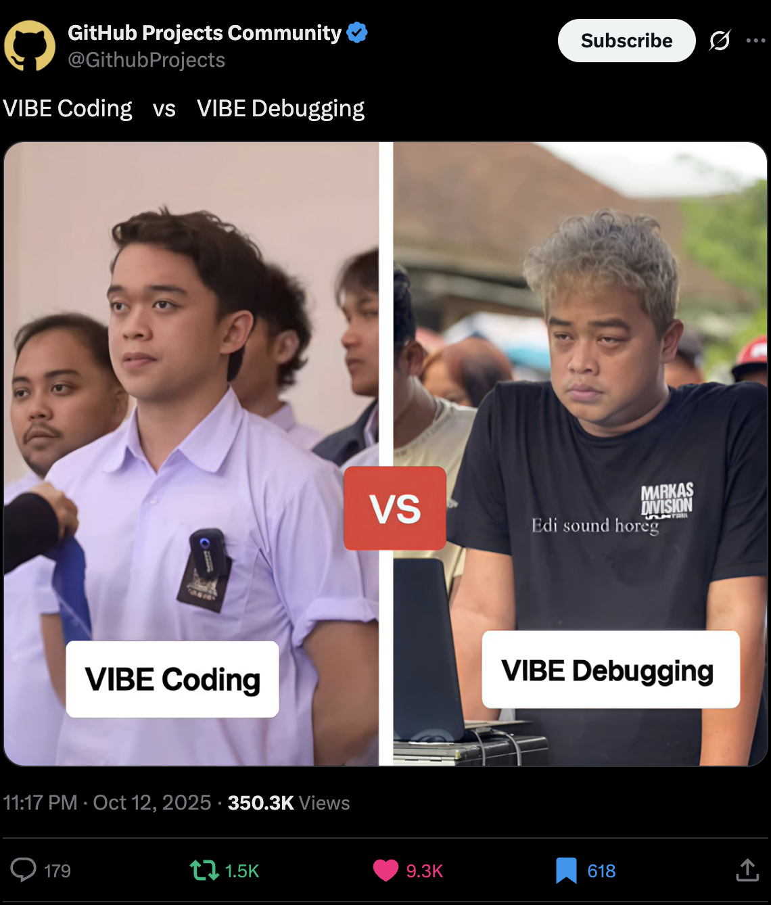
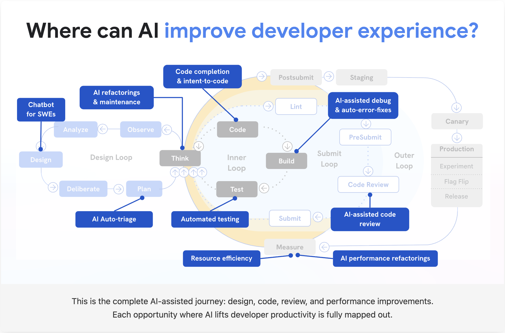

# Be a **10% Engineer** with AI

Working ~10% of the time, achieving ~100% of the output

<!--
Speaker notes:
Introduce the title. Emphasize shift: from hero coder (10×) to leveraged coder (10%) with AI.
Key point: This isn't about working less and slacking off—it's about achieving the same or better output with strategic leverage.
Mention that this might sound impossible, but by the end of this talk, you'll see why it's not only possible, but becoming essential.
-->

---

## 👋 Introduction

<https://www.zainfathoni.com/about>

- :round_pushpin: Jember :arrow_right: Bandung :arrow_right: :singapore: SG
  :arrow_right: Jogja
- :hammer_and_wrench: Backend :arrow_right: Manager :arrow_right: Frontend
  :arrow_right: Fullstack
- :robot: 10% Engineer\*

---

## ✨ The Phenomenon

Ever notice a coworker who spends less time working yet delivers more
results?

<!--
Speaker notes:
STORY: Set the scene—relatable personal anecdote. Express wonder that work-velocity can be compressed.
Add details: What were you working on? (e.g., "Migrating our codebase from Polaris v10 to v12")
The feeling: Initially anxious about the 3-hour window, but surprised by how much you accomplished.
The key: Strategic use of AI for repetitive tasks, leaving mental energy for critical decisions.

OBSERVATION: Direct the audience to think: we've seen this. The question is: what's their secret?
Make it relatable: "You've probably felt frustrated or curious about this person."
Transition: "I used to think they were just naturally gifted. But I've learned there's a pattern to their behavior."

CONNECTION: Use rhetorical questions to bridge to the core insight.
Ask: "How do they do it? Are they simply smarter? Luckier? Or is there something else at play?"
Pause after each question. Let the audience wonder.
Then: "The answer might surprise you. It's not about IQ or luck—it's about leverage."
-->

---

## 📊 The Data

**4,867 developers:** AI coding assistants → **+26% more PRs per week**

**But:** Experienced devs with AI → **19% slower** on issues

**Why?** They added AI to old workflows instead of redesigning them.

→ **Leverage trumps brute force.** The "10% engineer" is plausible.

<!--
Speaker notes:
INSIGHT: Use data to ground the claim. Emphasize nuance: AI can accelerate, but requires workflow change.
Explain the paradox: "Why did experienced devs take 19% longer? Because they didn't change their workflow—they just added a tool on top."
The key insight: "AI is powerful, but only when paired with new habits and workflows."
Introduce the idea of 10% engineer as achievable: "This is why the 10% engineer is no longer fantasy—it's the natural evolution of how we work."
-->

---

## 🗺️ Today's Journey

1. Why this matters **now**
2. What AI changes (and what it doesn't)
3. **Habits** to unlock efficiency
4. **Pitfalls** to avoid
5. Your **action plans**

→ **North star:** 10% time = 100% output → **Reality:** 20-80% time saved is already huge

<!--
Speaker notes:
AGENDA: Walk through what we'll cover. Set expectations for what audience will get.
Emphasize: "This isn't theoretical. You'll walk away with concrete habits, workflows, and an action plan you can start Monday."
Build anticipation: "By the end, you'll see exactly how to become a 10% engineer—and avoid the traps that slow people down."

LESSON: Reconcile aspirational (10%) with realistic (20-80%) so audience doesn't tune out.
Important: "Don't let perfect be the enemy of good. Even cutting your work time to 80% while maintaining output is a 20% efficiency gain."
Set the tone: "We're going to be practical, not idealistic. Small wins compound."
Transition: "Now let's dive into why this matters right now—and how AI has changed the game."
-->

---

## 🚀 What is 10x Engineer?

> It's an engineer who's **10 times better** at their job than their peers.

- <https://newsletter.lwastuargo.com/p/what-is-10-engineer>

---

### 💡 What is 10% Engineer?

> 10% engineer is a **10x engineer** who has **high degree of efficiency** thus only requiring to work 10% of the time to accomplish similar result **expected** out of them.

- <https://newsletter.lwastuargo.com/p/what-is-10-engineer>

---

### 🎯 Be a 10x Engineer

1. Choose a company
2. Become a senior engineer
3. Spot and execute staff-level projects
4. Pick an archetype

- [Be a 10x Engineer](https://newsletter.lwastuargo.com/p/10-engineer-ingredient-be-a-10x-engineer)

---

### ⚡ Be Insanely Efficient

- <https://newsletter.lwastuargo.com/p/10-engineering-ingredient-be-insanely>

---

## ⏰ Why Now?

**The AI Shift** has inverted the difficulty landscape:

| Before AI                    | With AI                         |
| ---------------------------- | ------------------------------- |
| Easy tasks → Still manual    | Easy tasks → Trivial            |
| Hard tasks → Grind it out    | Hard tasks → Manageable         |
| Impossible tasks → Don't try | Impossible tasks → The new hard |

→ This inversion means **efficiency matters more than ever**

<!--
Speaker notes:
Explain macro shift: AI changes what's easy/hard. Use the table to visualize the transformation.
Example: "Setting up a new project used to take hours. Now? 5 minutes with AI scaffolding."
"Refactoring 1000 files used to be 'impossible'—now it's just 'hard' with AI assistance."
The key: "If you're still doing easy tasks manually, you're leaving 10x efficiency on the table."
-->

---

## 📈 How Zapier Measure AI Fluency

---

---

## ⚠️ VIBE Coding vs VIBE Debugging

**AI can help you write code fast**

But you MUST understand what you wrote

→ Otherwise: Welcome to VIBE Debugging (the nightmare)

---

## 🤖 Introducing: AI-Assisted Engineering

- <https://beyond.addy.ie/>

---

---

---

---

---

## 🎓 Why Expertise Matters

**Expertise enables AI leverage:**

- Good judgment: frame problems, assess options, decide which path matters
- Pattern recognition: spot edge cases, catch what AI misses
- System thinking: understand context, ask right questions, validate results

→ **Without expertise, AI is just a faster way to fail**

---

## 🛤️ The Path Forward

**Better expertise = better AI partnership:**

- Tools raise the ceiling of what you can do
- Rich skillset → better feedback → better AI contribution
- Black-box oracle = misuse risk. **Critical eye remains vital.**

→ **Expertise is the foundation. AI is the amplifier.**

---

## 🔑 3 Core Habits to Unlock Efficiency

1. **Identify** leverage points (where does your time go?)
2. **Automate** with AI (build your stack)
3. **Measure** & iterate (track what matters)

→ Small wins compound into 10% engineer results

<!--
Speaker notes:
Introduce the framework: "These 3 habits form the foundation of the 10% engineer mindset."
"They're simple but powerful when applied consistently."
Preview: "We'll walk through each with concrete examples."
Emphasize iteration: "You don't need to master all 3 at once. Start with one, then add the next."
-->

---

## 🎯 Habit 1: Find Your Leverage Points

**Week 1 Time Audit - Example:**

| Task             | Hours/Week | Leverage? |
| ---------------- | ---------- | --------- |
| Component boiler | 6h         | ✅ High   |
| PR reviews       | 5h         | ⚠️ Medium |
| Writing tests    | 4h         | ✅ High   |
| Architecture     | 3h         | ❌ Low    |
| Meetings         | 7h         | ❌ Low    |

**Target:** 10h of repetitive work → AI can reclaim 8h/week

<!--
Speaker notes:
Practical exercise: "Track one week honestly - every task over 15 minutes."
Walk through the example: "Notice 10 hours on boilerplate and tests - that's 40% of the week."
"Only 3 hours on high-value architecture work."
The opportunity: "AI can handle 80% of that repetitive work."
"That's 8 hours reclaimed - now you can do 3x more architecture."
Ask: "What would you do with 8 extra hours a week?"
-->

---

## 🛠️ Habit 2: Master Your AI Tool

| Task                     | How I Use Claude Code | Time Saved |
| ------------------------ | --------------------- | ---------- |
| Multi-file refactoring   | Bulk transforms       | ~70%       |
| Writing slides & docs    | Content generation    | ~80%       |
| Code generation          | Context-aware coding  | ~60%       |
| Test writing             | Pattern-based tests   | ~50%       |
| Architecture exploration | Quick prototypes      | ~65%       |

→ **Deep mastery of ONE tool > shallow use of many tools**

<!--
Speaker notes:
Personal story: "I use Claude Code for almost everything. This slide? Built with Claude Code."
"I've optimized my entire workflow around one tool rather than spreading across many."
"Why? Because deep mastery unlocks capabilities you miss when tool-hopping."

The key insight: "You don't need 10 different AI tools. You need ONE tool you know deeply."
"I know Claude Code's strengths, limitations, edge cases. I've built custom workflows, refined prompts, learned the patterns."
"That depth gives me more leverage than surface-level knowledge of 10 tools."

Examples:
"Multi-file refactoring: Claude Code can transform 50 files in one go. I know how to structure that request."
"Writing: This entire slide deck was created iteratively with Claude Code."
"Code generation: Not just autocomplete - full features with context across the codebase."
"Architecture: I can prototype 3 different approaches in 30 minutes and compare."

The lesson: "Start with ONE tool. Master it. Then decide if you need more."
"Your tool might be Cursor, Copilot, Cody - doesn't matter. What matters is depth over breadth."
"Track time before and after. Refine your usage. Build it into muscle memory."
-->

---

## 📊 Habit 3: Measure & Iterate

- AI tools cost money (personal budget or company spend)
- Better prompts = fewer tokens = better results + lower costs

**Track your usage:**

- Run `ccusage` in your project to see token consumptions history
- Check [claude.ai/settings/usage](https://claude.ai/settings/usage) for overall
  usage

→ **Smart usage = sustainable AI workflow**

<!--
Speaker notes:
"Let's talk about something practical: costs."
"Whether you're paying yourself or your company is paying, AI tools aren't free."
"The good news: optimizing for cost also optimizes for results."

How to track:
"In Claude Code, run `ccusage` to see your token consumption for the current session."
"Check claude.ai/settings/usage to see your overall monthly usage and costs."

How to optimize:
"Be specific and concise in your prompts. Rambling prompts waste tokens and confuse the AI."
"Use Plan Mode - it lets you review the plan before executing, saving you from costly mistakes."
"Provide relevant context only. Don't dump your entire codebase - be strategic about what context matters."
"Iterate on your prompts. A well-refined prompt gets you the right answer in one shot instead of 5 back-and-forths."

The win-win:
"Better prompts = fewer tokens = lower costs AND better results."
"This is what 10% engineers do - they're strategic about everything, including AI costs."
"A sustainable AI workflow is one you can afford to maintain long-term."
-->

---

## ✅ Tip: Always use **Plan Mode**

---

## ⚠️ Pitfalls to Avoid

1. **Over-reliance** without review
2. **NOT learning** - losing understanding of your code
3. **Hours mindset** instead of value mindset
4. **Tool adoption** without workflow redesign

<!--
Speaker notes:
"AI comes with traps - but they're predictable and avoidable."
"We'll focus on the most common ones I see repeatedly."
-->

---

## 🐛 Case Study: The Never Ending Bug

**What happened:**

- Team used AI to generate a new add-on module
- Code looked messy, but tests passed ✅
- Shipped without thorough review 🚀
- **Bug:** Add-ons weren't properly integrated with other parts 🔴
- **Result:** Never ending bug in production 💥

**The lesson:** Always review AI code line-by-line, especially feature &
security-critical code

<!--
Speaker notes:
Real example: "This actually happened to a team I consulted with."
"The AI-generated code was professional-looking. Tests passed."
"But nobody caught that it was missing an essential edge case."
The key: "Treat AI like a junior dev. Trust, but verify."
"Especially for security, performance, and edge cases."
-->

---

## 🤦 Case Study: The Forgotten Function

* ❓ Anyone knows `setTimeout` in JavaScript?
* 🙋🏻 How to make it repeat instead of once?

### 😢 Sad fact

* 🤕 I just failed an interview because I forgot that `setInterval` exists.

---

## 🎓 Learn by Doing with Claude Code

Ask Claude Code to use **Learning mode** → `TODO(human)` markers show where you code → You write the logic, Claude guides

🤖 AI: boilerplate + complexity 👤 You: core logic + decisions

📖 Learn more:
[docs.claude.com/output-styles](https://docs.claude.com/en/docs/claude-code/output-styles)

---

## 📅 Your 90-Day Action Plan

### 🏗️ Month 1: Foundation

**Week 1:** Time audit + identify leverage points

**Week 2-3:** Pick ONE workflow → automate with AI

**Week 4:** Measure results, iterate

→ **Don't try to boil the ocean. Master ONE workflow first.**

<!--
Speaker notes:
"This is your roadmap for the next 90 days. Let's start with Month 1."
"Month 1 is all about foundation - building the habit, proving it works."
"Week 1: Track your time honestly. Find where 40% of your week goes to repetitive work."
"Week 2-3: Pick ONE workflow. Not five. ONE. Maybe it's test generation. Maybe it's boilerplate."
"Master it. Refine your prompts. Build it into muscle memory."
"Week 4: Measure. Did you save time? Improve quality? Track the numbers."
"Don't try to boil the ocean. If you nail one workflow in Month 1, you've won."
"This foundation is critical. Get this right, everything else follows."
-->

---

## 📈 Months 2 & 3: Scale & Multiply

### 📈 Month 2: Scale

- Week 5-6: Add 2 more AI workflows
- Week 7-8: Redesign one major process end-to-end

### 🔄 Month 3: Multiply

- Week 9-10: Optimize & refine all workflows
- Week 11-12: Teach your team (multiply impact)

→ **The real 10x happens when you multiply through your team**

<!--
Speaker notes:
"Once you've proven it works in Month 1, now you scale."
"Month 2: Add 2 more workflows. You know the pattern now - identify, automate, measure."
"Week 7-8 is critical: redesign a major process end-to-end. Not just one task, but an entire workflow."
"By Month 3, you're operating at 2-3x efficiency. Now comes the multiplication phase."
"Optimize what you've built. Refine your prompts, tools, processes."
"Week 11-12: Teach your team. This is where 10% becomes 10x."
"When you help 5 teammates become 10% engineers, you've 10x'd your team's output."
"3 months from now, you'll be operating at a completely different level."
-->

---

## 🚀 Start Today

**Quick wins (each <1 hour):**

- :white_check_mark: Install Claude Code or GitHub Copilot
- :white_check_mark: Create time-tracking sheet (track this week)
- :white_check_mark: Write down your 3 most repetitive tasks
- :white_check_mark: Draft ONE AI prompt for a common task
- :white_check_mark: Set weekly review habit (Friday, 15 mins)

**Pick 2-3 to do this week**

<!--
Speaker notes:
Actionable immediately: "Don't wait for Monday. Start today."
"These are all sub-1-hour tasks. No excuses."
"Install Claude Code or Copilot - free trials available."
"Start tracking time THIS week. You'll be amazed where it goes."
"Write down repetitive tasks. Pattern recognition is step one."
"Draft one prompt template - for reviews, tests, whatever you do often."
"Weekly review on Friday: What worked? What didn't?"
Action: "Raise your hand if you'll commit to 2 of these this week."
-->

---

## 💡 Key Takeaways

**AI shifts the difficulty landscape** → Efficiency matters more than ever

**BUT: You MUST understand what you wrote** → Avoid VIBE Debugging, practice AI-Assisted Engineering

**The path:** 3 habits (Identify, Automate, Measure) + avoid 4 pitfalls + 90-day plan

→ **Even 20-80% time saved is already huge**

→ **The future belongs to leverage architects, not hero coders**

<!--
Speaker notes:
"Let's wrap up with the core messages."
"AI has changed the game. Easy tasks are trivial, hard tasks are manageable."
"But speed without understanding is dangerous. You need to learn while using AI."
"You now have the framework: habits, pitfalls, action plan."
"Don't aim for perfection. Even cutting time to 80% is a 20% gain."
"The shift: from hero coder grinding 80-hour weeks to leverage architect shipping 10x value in 40 hours."
Call to action: "Pick one workflow TODAY. Apply AI. Measure. Iterate."
"Thank you. Now go build something amazing - in less time."
-->

---

## 🙏 Thank You

🔗 **Slides:** [zainf.dev/10-percent-engineer](https://zainf.dev/10-percent-engineer)

