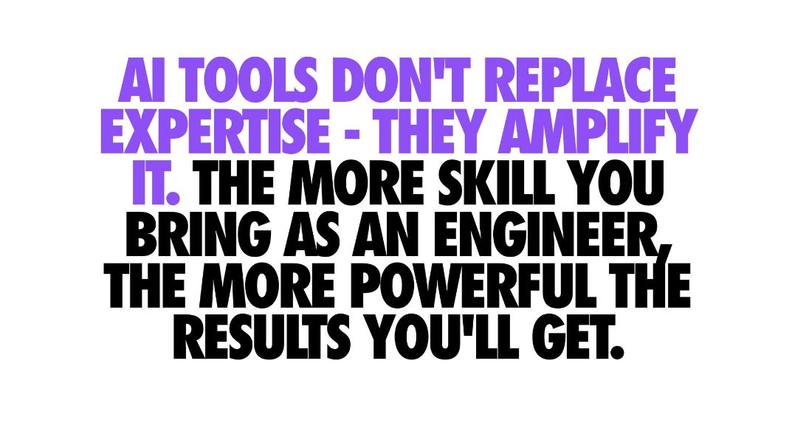
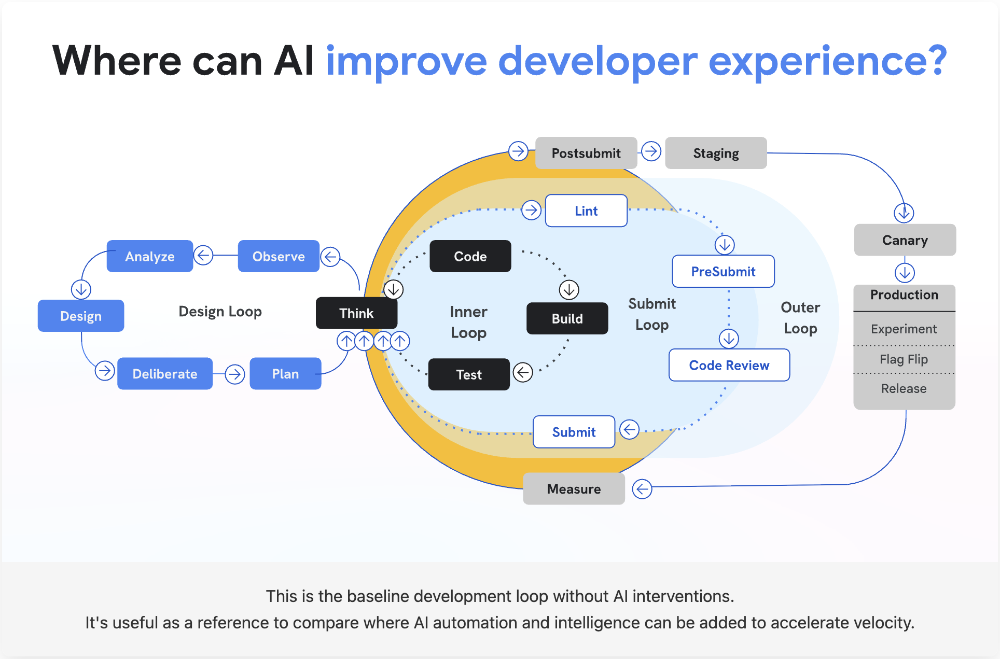

# Fundamental CS for AI Era

Building human-centered digital products in the AI era

### I'm Zain Fathoni

Front-end developer based in Yogyakarta, Indonesia. Previously backend, manager, frontend, now fullstack.

Community builder · AI-assisted engineering practitioner · Mentor Spotlight at BUILD Camp.

<https://zainf.dev>

<!--
P1 — Who & What / Clarity.
Use the poster title, but frame it with the product-building tagline from the announcement.
-->

---

P2 · Common Ground

## Our work now demands AI fluency

Developers, designers, and product builders are all being asked to move faster.

Not someday. **This sprint.**

<!--
Writing for Public equivalent: “Our lines of work demands writing.”
Here: product work now demands AI fluency, whether you like it or not.
-->

---

P3 · Coming Problem

## Understanding is more important than ever

AI can generate code faster than we can review it.

The bottleneck moves from **typing** to **understanding what changed, why it works, and what it might break.**

Geoffrey Litt

<blockquote>

Understanding matters not just to verify, but **to participate**.

</blockquote>

From “Understanding is the new bottleneck”

<!--
Use Geoffrey Litt's longer article, not just the tweet. Key idea: understand to participate, not merely to verify.
-->

---

P4 · Emotional Win

## But learning has never been easier

AI can explain code, generate examples, create quizzes, and build tiny tools to help us understand.

The opportunity: use AI as a **learning amplifier**, not just a code printer.

AI × CS

The win is not “skip fundamentals.” The win is “learn fundamentals faster, with feedback.”

<!--
Writing for Public equivalent: “But writing has never been easier than ever!”
Here: learning and understanding are easier if we use AI correctly.
-->

---

P5 · False Hope

## Does vibe coding even work, though?

It works until you hit the part where the codebase has history, constraints, edge cases, and users.

That is where lazy delegation becomes expensive.

Prompt harder

↓

Get more code

↓

Understand less

↓

Debug longer

<!--
Use Dex Horthy / “against lazy engineers” as the spine: research, plan, implement; don't just argue with the model or let it wander.
-->

---

P6 · Audacious Reality

## What if fundamentals are the AI multiplier?

Fundamentals give you the words, mental models, and constraints to steer AI:

- data structures
- algorithms
- systems thinking
- debugging
- trade-offs

<!--
Core thesis. AI doesn't erase fundamentals; it rewards people who can express fundamentals as constraints.
-->

---

P7 · We Can Do This

## Read the code, but not all of it

The skill is not reading every line.

The skill is knowing **which code is worth reading** before you ask AI to change it.

Gergely Orosz

<blockquote>

We read existing code much more often than we write new code.

</blockquote>

Related post on AI-assisted coding and reading code

<!--
Use Gergely's accessible LinkedIn snippet. This slide turns “read the code” into a practical skill: target selection.
-->

---

P8 · Call To Action

## Here are the first things to do to get started…

<ol class="small-list">
<li><strong>Research</strong> the code before prompting.</li>
<li><strong>Plan</strong> the exact behavior change.</li>
<li><strong>Implement</strong> with AI in small loops.</li>
<li><strong>Verify</strong> with tests, types, or screenshots.</li>
<li><strong>Explain</strong> what changed in your own words.</li>
</ol>

<!--
Writing for Public equivalent: Capture, Align, Reformat, Publish, Repeat.
Here: Research, Plan, Implement, Verify, Explain. Dex's “research, plan, implement” plus Geoffrey's speed-regulator idea.
-->

---

P9 · Early Benefits

## Reaping early benefits

When you practice fundamentals with AI, you get compounding returns quickly:

- better prompts
- faster reviews
- fewer hallucinated fixes
- calmer debugging
- clearer product decisions

<strong>Instead of:</strong>

“AI wrote this; I hope it works.”

<strong>You can say:</strong>

“Here is the invariant, here is the trade-off, here is how we verified it.”

<!--
Writing for Public equivalent: “Ripping/Reaping early benefits.”
Near-term reward: confidence and review quality.
-->

---

P10 · Long Win

## Increasing the surface of agency

In the AI era, human-centered builders are not the people who type the most code.

They are the people who can frame problems clearly enough for humans and machines to solve together.

<!--
Writing for Public equivalent: “Increasing the surface of luck.”
Here: agency. Tie back to BUILD Camp tagline: human-centered digital products.
-->

---

## References

- Dan Roam — [The Pop-up Pitch](https://www.danroam.com/)
- Geoffrey Litt — [Understanding is the new bottleneck](https://www.geoffreylitt.com/2026/07/02/understanding-is-the-new-bottleneck.html)
- Gergely Orosz — reading code in the AI era
- Dex Horthy — research, plan, implement; avoid lazy AI loops
- Zain Fathoni — [A to Z #3](https://zainf.dev/a-z-3)

<blockquote>

Fundamentals are not the past.

They are how we steer the future.

</blockquote>

<!--
Reference slide. Keep the citations visible without turning the talk into a literature review.
-->

---

# Q & A

<https://zainf.dev/fundamental-computer-science-ai-era>

<https://zainf.dev/a-z-3>

