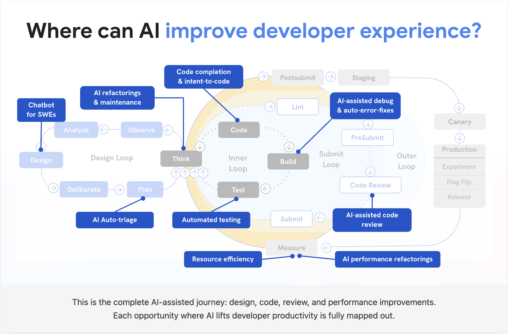
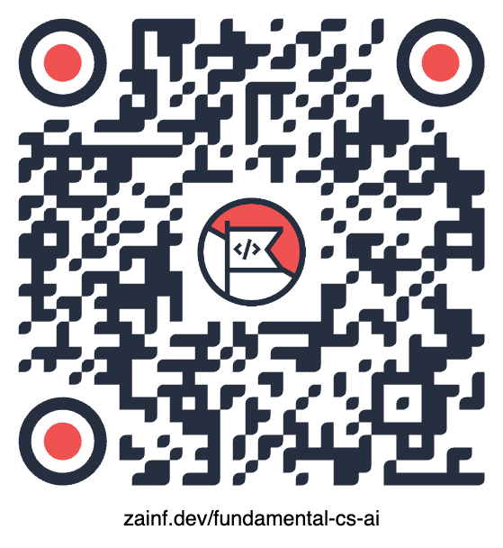

# Fundamental CS for AI Era

Building human-centered digital products in the AI era

<h3 class="signature">Zain Fathoni</h3>

Senior Software Engineer based in Yogyakarta, Indonesia. Previously backend, manager, frontend, now fullstack.

Community builder (Ketua [VibeFromCafe.id](https://vibefromcafe.id)) · Agentic Engineering Practitioner.

<https://zainfathoni.com>

<!--
P1 — Who & What / Clarity.
Fundamental Computer Science for AI Era. Frame with the product-building tagline.
-->

---

P2 · Common Ground

## AI makes code generation fast and accessible

Anyone in this room can ship working code today — developer or not.

Generating code is no longer the hard part. **We all agree on that.**

<!--
P2 — Common Ground: AI makes code generation fast and accessible.
Everyone here has felt this. Establish agreement before introducing tension.
-->

---

P3 · Coming Problem

## Understanding becomes the bottleneck

AI generates code faster than we can understand it.

The constraint moves from **writing** code to **understanding what changed, why it works, and what it might break.**

Thariq, on Fable 5: work quality is now “bottlenecked by my ability to clarify my unknowns.” — <a href="https://x.com/trq212/status/2073100352921215386">Finding Your Unknowns</a>

Geoffrey Litt · 2 July 2026

<blockquote>

Hot take: I think it's still important to understand the code that our agents write!

</blockquote>

Understanding matters not just to verify, but to participate. — “Understanding is the new bottleneck” <a href="https://x.com/geoffreylitt/status/2072522251300409556">x.com/geoffreylitt/status/2072522251300409556</a>

<!--
P3 — Coming Problem: understanding becomes the bottleneck.
Litt's tweet (333.8K views) + his article. Key idea: understand to participate, not merely verify.
Second voice: Thariq's "A Field Guide to Fable: Finding Your Unknowns" (651K views) — the map
(prompts, skills, context) is not the territory (codebase, real constraints); quality is bottlenecked
by your ability to clarify your unknowns. x.com/trq212/status/2073100352921215386
-->

---

P4 · Emotional Win

## Imagine calm confidence in any codebase

Opening an unfamiliar repository without dread.

Reviewing an AI-generated PR and **knowing** what to look at first.

That feeling is trainable — and AI itself can train it.

AI × CS

The win is not “skip fundamentals.” The win is “learn fundamentals faster, with feedback.”

<!--
P4 — Emotional Win: calm confidence in any codebase.
Paint the feeling before the argument. This is what fundamentals buy you emotionally.
"Trainable" is Thariq's exact conclusion: "reducing your unknowns is the skill of agentic coding —
a skill you can improve at, by working with Claude." Confidence = few unknowns, and unknowns shrink with practice.
-->

---

P5 · False Hope

## “AI means I can skip fundamentals”

Tempting — but this is what it looks like from the receiving end:

Dex Horthy · 20 June 2026

<blockquote>

If people are tokenmaxxing bugs into production with kLOC PRs that they didn't read themselves, those people shouldn't have jobs.

</blockquote>

“Coaching juniors on SWE fundamentals is hard work and it takes time.” <a href="https://x.com/dexhorthy/status/2068433796182270203">x.com/dexhorthy/status/2068433796182270203</a>

<!--
P5 — False Hope: "AI means I can skip fundamentals."
Dex's rant against lazy engineers. Skipping fundamentals taxes your seniors and your future self.
-->

---

P6 · Audacious Reality

## Fundamentals are the AI multiplier

Data structures, algorithms, systems thinking, debugging, trade-offs.

They give you the **taste** to judge AI output and the **words** to steer it.

Gergely Orosz · 2 July 2026

<blockquote>

If you don't know what good code looks like, you will have no idea if what the models generate are any good.

</blockquote>

“This is exactly why experienced software engineers are valuable and will be valuable.” (via @mitchellh) <a href="https://x.com/GergelyOrosz/status/2072831495463428580">x.com/GergelyOrosz/status/2072831495463428580</a>

<!--
P6 — Audacious Reality: fundamentals are the AI multiplier.
Gergely (via Mitchell Hashimoto): knowing what good looks like is the judging skill AI can't replace.
Same argument from Thariq: "the best agentic coders are good but have relatively few unknowns" —
they know what they want in detail, deeply in-sync with both the codebase and the model's behaviors.
Fundamentals are what convert unknown unknowns into known knowns.
-->

---

P7 · We Can Do This

## Guard AI's work at three time horizons

Each guard is an open-source skill you can install today.

The first two guard the **code**. The third guards **you**.

<strong>⏱️ Now — E2E evidence</strong>

<code>/pr-e2e-evidence</code> — prove the change works today, in a real browser, before it ships.

<strong>📆 Near future — unit tests</strong>

<code>/tdd</code> — lock the behavior in so it can't quietly regress. (Matt Pocock, aihero.dev/skills)

<strong>🧠 Always — understanding</strong>

<code>/teach</code> — keep yourself able to chime in whenever future issues or plans arise.

<!--
P7 — We Can Do This: three guards, three time horizons.
E2E = works NOW. TDD = won't regress NEAR. Understanding = you can ALWAYS participate.
/pr-e2e-evidence and /teach: github.com/zainfathoni/agent-workflows. /tdd: Matt Pocock's aihero.dev/skills
(/teach also started as Matt's — credit him out loud).
-->

---

P8 · Call To Action

## Start with the long-term guard: `/teach`

An open-source skill that turns understanding into a **persistent learning workspace**.

<ol class="small-list">
<li>Grab it: <strong>github.com/zainfathoni/agent-workflows</strong></li>
<li>Run <code>/teach</code> with any topic you want to learn</li>
<li>Answer the interview, take one lesson and its quiz</li>
<li>Return anytime — it remembers where you left off</li>
</ol>

🎯 MISSION.md — why you're learning

📚 lessons/ — short, single-win lessons

📝 quizzes — speed regulators for real understanding

🗂️ learning-records/ — evidenced progress

Quizzes as speed regulators — the same technique Geoffrey Litt proposes for understanding AI code.

<!--
P8 — Call To Action: the first doable step is using the /teach skill.
Open-sourced at github.com/zainfathoni/agent-workflows. Concrete, tonight-sized steps.
-->

---

P9 · Early Benefits

## You can learn anything you want

Not just CS fundamentals. The same workspace teaches you:

- a new framework or language
- an unfamiliar codebase, one PR at a time
- algorithms and system design
- even non-code topics

<strong>Instead of:</strong>

passive tutorials you abandon by chapter three.

<strong>You get:</strong>

a personal curriculum with lessons, quizzes, and memory — your own <a href="https://brilliant.org">Brilliant</a>, crafted from Papert-style micro-worlds.

Live proof: <a href="https://ai.zainf.dev">ai.zainf.dev</a> — my own AI-inference learning lab. That journey just started, in public.

<!--
P9 — Early Benefits: the audience can learn anything they want.
The immediate reward of the CTA: a tutor that adapts and remembers, for any topic.
"Your own Brilliant" via micro-worlds — Litt's technique (inspired by Seymour Papert):
x.com/geoffreylitt/status/2072522314240127393. Show ai.zainf.dev briefly if time allows:
lessons, learning records, experiments — the /teach workspace shape, applied to AI inference.
-->

---

P10 · Long Win

## Engineers become better problem framers

In the AI era, human-centered builders are not the people who type the most code.

They are the people who can **frame problems clearly enough for humans and machines to solve together.**

Gogo (@lwastuargo) · 1 July 2026

<blockquote>

It's actually a huge relief that the future of software engineering… is still software engineering.

</blockquote>

“Even expensive loop engineering with a state-of-the-art model can't out-engineer bad system design.” <a href="https://x.com/lwastuargo/status/2072256396633260350">x.com/lwastuargo/status/2072256396633260350</a>

<!--
P10 — Long Win: engineers become better problem framers.
Gogo's lessons from building Anna: the highest-leverage work is the right system design.
Litt: "The point was always to augment, not just automate." Tie back to human-centered digital products.
-->

---

# Live Demo

Let's learn something together — for real, for the next hour.

🙋 You pick the topic. You answer the quizzes.

<!--
Section break. ~15 minutes of slides done; now ~60 minutes of hands-on demo with audience participation.
Energy shift: close the laptop lid metaphorically, open the terminal.
-->

---

## How the next hour works

<ol class="small-list">
<li><strong>Pick</strong> (10 min) — you shout topics, we vote on one</li>
<li><strong>Mission</strong> (15 min) — <code>/teach</code> interviews us; you answer, I type</li>
<li><strong>Learn</strong> (20 min) — we take the first generated lesson together</li>
<li><strong>Quiz</strong> (15 min) — you answer; wrong answers steer the next lesson</li>
</ol>

<strong>Ground rule:</strong>

I will not edit the AI's questions or lessons. What you see is what the skill does.

<strong>Case study, if the room is shy:</strong>

Big-O notation — from my earlier slides at <a href="https://zainf.dev/big-o">zainf.dev/big-o</a>, with the workspace already live at <a href="https://big-o.zainf.dev">big-o.zainf.dev</a>.

<!--
Demo agenda. Timebox each round out loud. If the room is quiet, use the Big-O case study:
the workspace is pre-seeded at ~/Code/GitHub/zainfathoni/big-o (live at big-o.zainf.dev) —
MISSION.md, RESOURCES.md, and lesson 1 with its quiz are ready; run the quiz, then build
lesson 2 live from the wrong answers (best/worst/average case, then Θ vs O vs Ω).
Bonus live moment: RESOURCES.md records an erratum in my own 2020 deck (slide 34, Big-Ω).
Round 2 (Mission) is where audience participation locks in — their answers shape MISSION.md live.
-->

---

## What we'll watch it build

A learning workspace, growing live on screen:

- `MISSION.md` — the room's shared goal
- `RESOURCES.md` — sources we trust
- `lessons/*.html` — one win per lesson
- `learning-records/*.md` — proof of what we learned

<blockquote>

Understanding matters not just to verify, but to participate.

</blockquote>

Geoffrey Litt — this hour is that idea, practiced.

Latest demo lessons: <a href="https://zainfathoni.github.io/seo/">SEO</a> · <a href="https://zainfathoni.github.io/utune-ai-lessons/">UTUNE AI Lessons</a>

<!--
Anatomy slide — narrate the file tree as it grows. Connect back to Litt: explainer docs, quizzes as
speed regulators, micro-worlds ("inspired by the visionary educator Seymour Papert" —
x.com/geoffreylitt/status/2072522314240127393). The demo IS the argument of the talk.
This hour is also Thariq's playbook practiced: interviews and quizzes to surface unknown unknowns.
-->

---

## References

- Geoffrey Litt — [Understanding is the new bottleneck](https://www.geoffreylitt.com/2026/07/02/understanding-is-the-new-bottleneck.html) · [micro-worlds](https://x.com/geoffreylitt/status/2072522314240127393)
- Thariq — [Finding Your Unknowns](https://x.com/trq212/status/2073100352921215386)
- Dex Horthy — [against lazy engineering](https://x.com/dexhorthy/status/2068433796182270203)
- Gergely Orosz — [knowing what good code looks like](https://x.com/GergelyOrosz/status/2072831495463428580)
- Gogo — [the future of software engineering… is still software engineering](https://x.com/lwastuargo/status/2072256396633260350)
- Matt Pocock — [aihero.dev/skills](https://www.aihero.dev/skills): the `/tdd` skill and the original `/teach`
- `/teach` and `/pr-e2e-evidence` — [github.com/zainfathoni/agent-workflows](https://github.com/zainfathoni/agent-workflows)
- Zain Fathoni — [A to Z #3](https://zainf.dev/a-z-3) · [Big-O](https://zainf.dev/big-o) · [ai.zainf.dev](https://ai.zainf.dev)

<blockquote>

Fundamentals are not the past.

They are how we steer the future.

</blockquote>

<!--
Reference slide. Keep citations visible without turning the talk into a literature review.
-->

---

# Q & A

<a href="https://zainf.dev/fundamental-cs-ai">zainf.dev/fundamental-cs-ai</a>

<a href="https://github.com/zainfathoni/agent-workflows">github.com/zainfathoni/agent-workflows</a>

<a href="https://zainf.dev/a-z-3">zainf.dev/a-z-3</a>

Zain Fathoni

