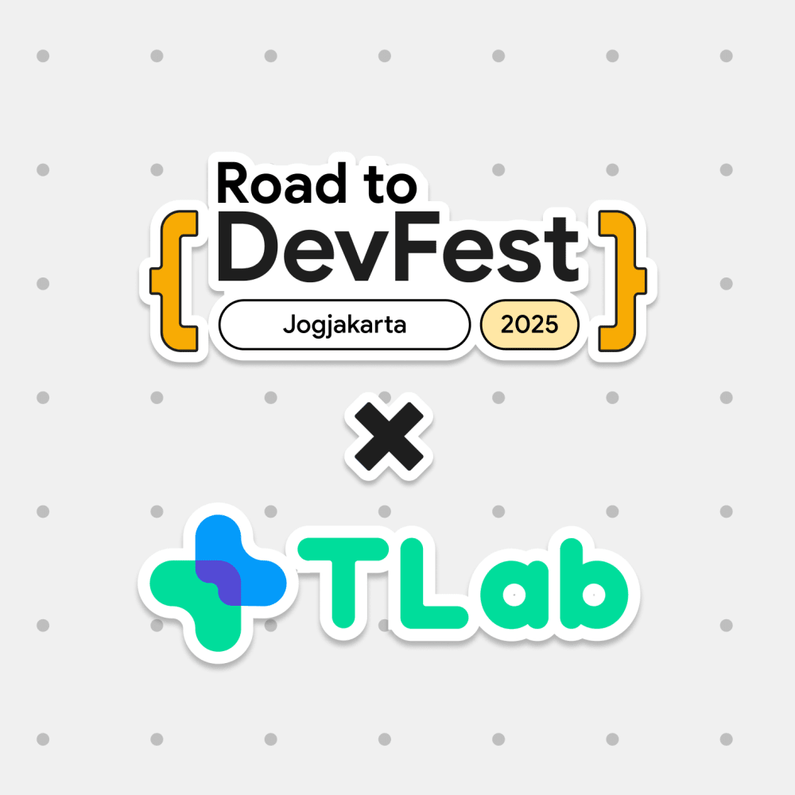
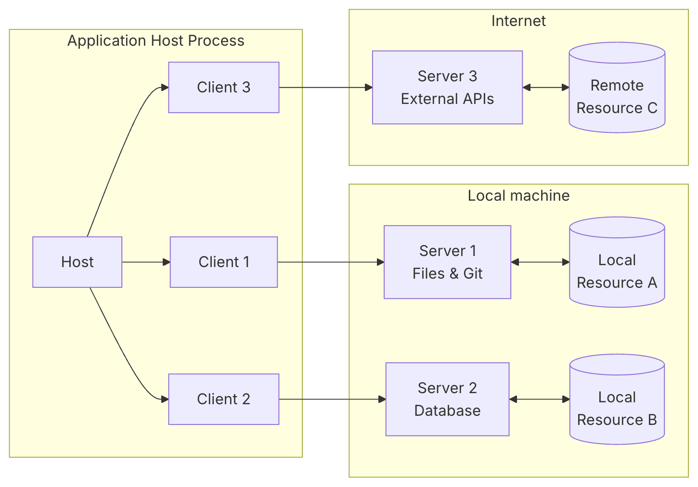
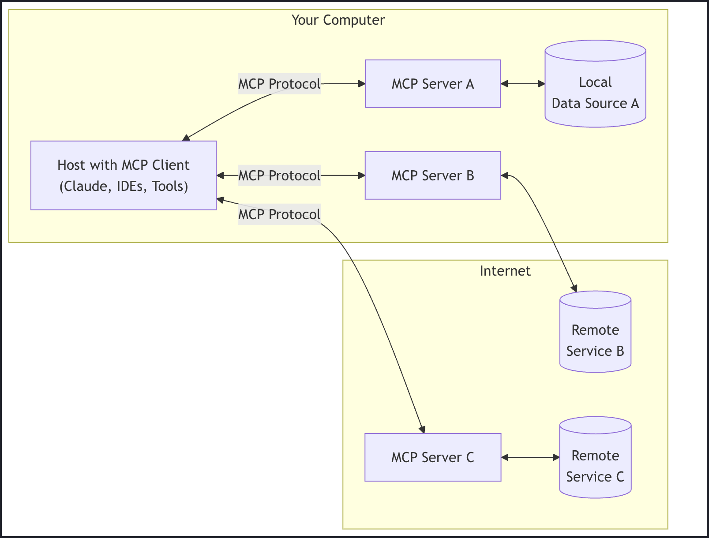
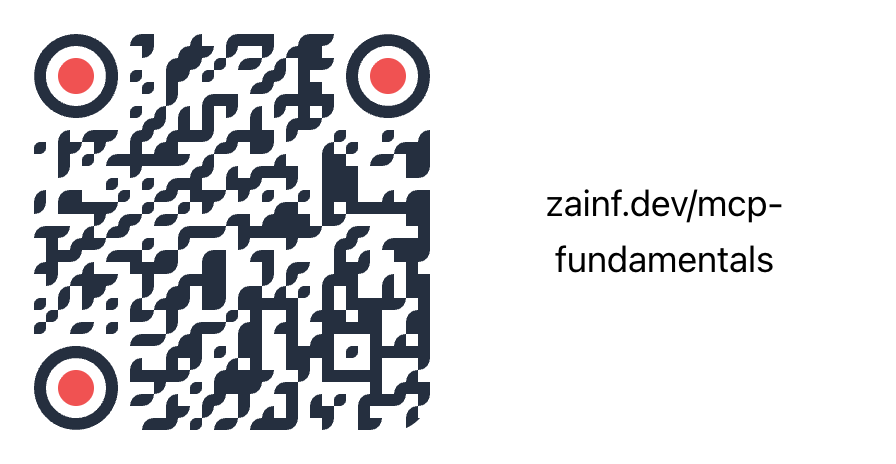

# MCP Fundamentals

## Building a Frontend for LLMs

---

## 👋 Introduction

<https://www.zainfathoni.com/about>

- :round_pushpin: Jember :arrow_right: Bandung :arrow_right: :singapore: SG
  :arrow_right: Jogja
- :hammer_and_wrench: Backend :arrow_right: Manager :arrow_right: Frontend
  :arrow_right: Fullstack
- :robot: AI Enthusiast :arrow_right: MCP Learner

---

## 📚 Agenda

1. Introduction to MCP
2. Building Blocks of MCP
3. Hands-on with MCP
4. Best Practices
5. Q&A

---

## ❓ What is MCP?

* Model Context Protocol (<https://modelcontextprotocol.io/>)
* 

---

## 🧱 Building Blocks of MCP

<https://modelcontextprotocol.io/specification/2025-06-18/architecture>

---

### 💻 Where to Host MCP?

---

## 🛠️ Best Practices

<https://useai.substack.com/p/mcp-tool-design-from-apis-to-ai-first>

* 🤖 **Think like the AI** - Design for instant comprehension
* 🎯 **Intent over endpoints** - Group by user goals
* 📦 **Self-contained responses** - Guide the next action
* ⚖️ **Find the sweet spot** - Balance granularity
* 🎓 **Let errors teach** - Teach correct usage

---

## 🚀 Let's Build

🔗 Repository: [github.com/epicweb-dev/mcp-fundamentals](https://github.com/epicweb-dev/mcp-fundamentals)

In this hands-on workshop you will:

- Create your first MCP server from scratch
- Implement tools and resources
- Connect it to your favorite LLM

---

## 🙏 Q&A

🔗 [zainf.dev/mcp-fundamentals](https://zainf.dev/mcp-fundamentals)

