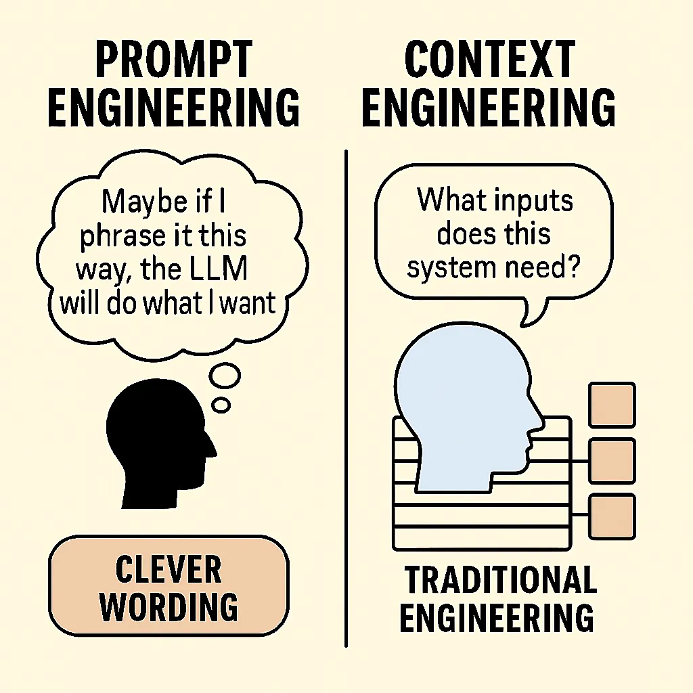
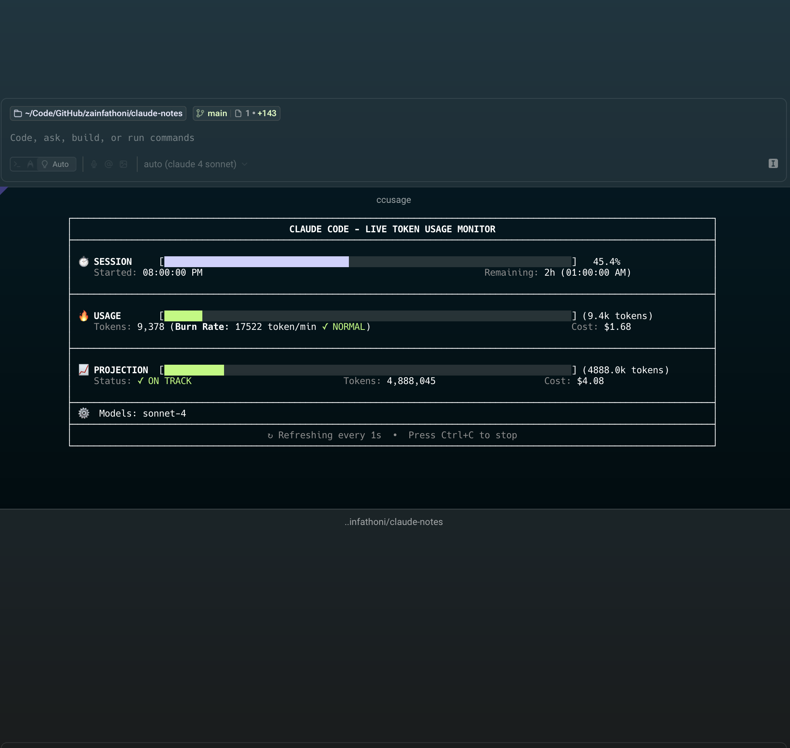

# Paket Hemat Claude Code

Membangun alur kerja dan belajar yang\
efektif :arrow_up: dan efisien :moneybag: dalam penggunaan AI

---

## Perkenalan

<https://www.zainfathoni.com/about>

- :round_pushpin: Jember :arrow_right: Bandung :arrow_right: SG :arrow_right:
  Jogja
- :hammer_and_wrench: Backend :arrow_right: Manager :arrow_right: Frontend
- :calendar: 1 bulan++ menggunakan Claude Code

---

## Agenda

1. **Membangun kesadaran bersama AI**
2. **Cara minimalisir halusinasi AI**
3. **Alur kerja memanfaatkan Claude Code**
4. **Tips hemat dan efektif dengan Claude Code**

---

## 1. Membangun Kesadaran Bersama AI

[The 70% Problem](https://addyo.substack.com/p/the-70-problem-hard-truths-about)

- Kita harus **sadar** (_conscious_) atas apa yang sedang terjadi
- Kita pastikan AI **napak tanah** (_grounded_) dengan kenyataan

---

## 2. Cara Minimalisir Halusinasi AI

- :brain: Context Engineering
- :hammer_and_wrench: Memilih Tech Stack yang ramah AI
- :shield: Trust, but Verify
- :test_tube: Pengujian Otomatis

---

## :brain: Context Engineering

[Context Engineering: Bringing Engineering Discipline to Prompts](https://addyo.substack.com/p/context-engineering-bringing-engineering)

- :keyboard: User Input
- :books: Retrieved Knowledge
- :speech_balloon: Prior Conversation
- :hammer_and_wrench: Tool Outputs

---

## :hammer_and_wrench: Memilih Tech Stack yang Ramah AI

[How to make your tech stack AI-friendly 📏](https://refactoring.fm/p/how-to-design-your-tech-stack-for)

- :brain: **AI sukses di mana manusia sukses**
- :wrench: **Buat batasan-batasan**
- :computer: **Semuanya sebagai kode**
- :dart: **Batasi konteks**
- :robot: **Desain untuk adopsi AI**

---

## :x: Ketika AI Bermasalah

### Jebakan Umum

- Instruksi yang kabur → hasil yang tidak konsisten
- Konteks yang hilang → halusinasi
- Terlalu bergantung → kehilangan kontrol
- Contoh nyata kegagalan saya dalam membuat slide ini kemarin
  - :see_no_evil: <https://app.warp.dev/block/K5VB2RoKQHyki2Erjub0fU>

---

## :x: Contoh Kasus Kegagalan AI

### Belajar dari Kesalahan Orang Lain

- <https://x.com/albertadevs/status/1947095566736904562>
- <https://x.com/anothercohen/status/1948878534262575430>
  - <https://x.com/spaniard_reject/status/1948807698947981486>
- <https://www.pcmag.com/news/vibe-coding-fiasco-replite-ai-agent-goes-rogue-deletes-company-database>

---

## :shield: Trust, but Verify

[The "Trust, But Verify" Pattern For AI-Assisted Engineering](https://addyo.substack.com/p/the-trust-but-verify-pattern-for)

### Strategi Validasi

- :white_check_mark: **Selalu review output AI**
- :test_tube: Terapkan pengujian otomatis
- :busts_in_silhouette: Jangan lupakan proses peer review
- :bar_chart: Terapkan standar kualitas metrik

<https://x.com/zainfathoni/status/1946533504252289377>

---

## :test_tube: Pengujian Otomatis

- :gear: Otomasi pengujian
- :rotating_light: Pengawasan berkelanjutan

### :wrench: Tools

- :performing_arts: Playwright MCP
- :test_tube: Vitest
- :clipboard: Storybook

---

## 3. Alur Kerja Memanfaatkan Claude Code

### Rencana Berbasis Markdown

- :clipboard: **Perencanaan terstruktur**
- :dart: Tujuan yang jelas
- :chart_with_upwards_trend: Pelacakan progress
- :arrows_counterclockwise: Perbaikan iteratif

---

## :clipboard: Contoh: Specs dari Kiro

### 3 File Utama

- :memo: **requirements.md** - EARS notation untuk requirement yang testable
- :art: **design.md** - Arsitektur teknis dan data flow
- :clipboard: **tasks.md** - Rencana implementasi yang detail dan trackable

<https://kiro.dev/docs/specs/concepts/>

---

## 4. Tips Hemat dan Efektif dengan Claude Code

- :moneybag: **Output token itu mahal**
- :clipboard: SELALU gunakan `⏸️ plan mode`
- :dart: Prompt yang spesifik dan ringkas
- :arrows_counterclockwise: Rangkum pola berulang
- :desktop_computer: Pantau dengan [ccusage](https://ccusage.com/)

---

## Strategi Plan Mode

### Alur Kerja Efisien

1. :clipboard: **Mulai dengan `⏸️ plan mode`**
2. :dart: Definisikan tujuan yang jelas
3. :arrows_counterclockwise: Iterasi pada requirement
4. :zap: Eksekusi dengan efisien

---

## Kesimpulan

- :brain: **Bangun kesadaran AI** - AI sukses di mana manusia sukses
- :hammer_and_wrench: **Buat tech stack AI-friendly** - Constraints, code,
  konteks terbatas
- :shield: **Percaya tapi verifikasi** - Review output + testing otomatis
- :clipboard: **Gunakan `⏸️ plan mode`** - Hemat token dengan perencanaan
  terstruktur
- :test_tube: **Integrasikan testing** - Playwright MCP untuk validasi visual

---

## :pray: Terima Kasih

:desktop_computer: <https://zainf.dev/paket-hemat-claude-code>

### Demo

Mengubah slide ini menjadi interaktif dengan format Reveal.js

:link: <https://github.com/zainfathoni/zainf>

Simak kode dan hasilnya (link menyusul): :link:
[VS Code Live Share](https://marketplace.visualstudio.com/items?itemName=MS-vsliveshare.vsliveshare)
