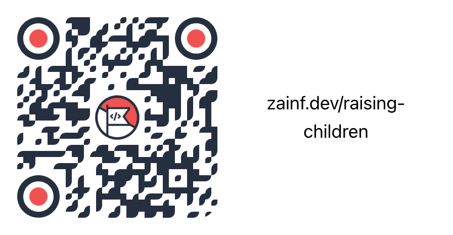

# Raising Children Who Outthink the Machines

## How AI can improve your kids' learning experience

Indonesia Software Developer Conference 2025
Zain Fathoni

---

## 👋 Introduction


<https://www.zainfathoni.com>

- :hammer_and_wrench: Software engineer (full-stack)
- :family: Homeschooling parent of three
- :robot: AI enthusiast & daily experimenter
- :globe_with_meridians: Jember → Bandung → SG → Jogja

---

## 📚 Agenda

1. **The Parent Anxiety** — Your fears are valid
2. **Resilience Mindset** — We've adapted before
3. **Three Core Strategies**
   - Support learning
   - Build literacy
   - Preserve connection
4. **Practical Examples** — What we do at home
5. **Your Action Plan** — Start this week

---

## The Parent Anxiety

### 🤔 Three Fears

- Will AI take my child's **future job**?
- Will screens **destroy their focus**?
- Will AI **replace thinking** instead of improving it?

---

### 💡 The Deeper Fear

> Our job is not to beat the machines.
> Our job is to raise **humans** who can **outthink and outgrow** the machines.

**Lifelong learners > lifelong scrollers.**

---

## Resilience: We've Adapted Before

### 📺 Remember Television?

Parents feared it would rot children's brains.

Then smartphones. Then social media.

Yet here we are—still thinking, still learning, still growing.

→ **The pattern:** New technology + Smart guidance = Thriving kids

---

### 🔄 Three Lessons from the Past

| Challenge       | Our Response                  | Result                       |
| --------------- | ----------------------------- | ---------------------------- |
| **TV**          | Set limits + choose content   | Kids learned & played        |
| **Internet**    | Teach critical thinking       | Kids created & explored      |
| **Smartphones** | Manage usage + model behavior | Kids adapted with boundaries |

→ **AI is the next chapter in this story.**

---

## Strategy 1: Support Learning

### 📖 AI as a Learning Partner

**Old way:**
Student → Textbook → Confusion → Give up

**With AI:**
Student → Ask AI → Understand better → Try again

- AI explains concepts multiple ways
- Students work at their own pace
- Boring homework becomes engaging

→ **Learning becomes joyful, not drudgery.**

---

### 📚 Real Example: Math Homework

Your child struggles with fractions.

Instead of memorizing rules:

- Ask AI: "Explain fractions like I'm 8"
- AI gives a pizza analogy
- Child _understands_ instead of _memorizes_
- Homework becomes 20 minutes instead of an hour

→ **Same learning, more confidence.**

---

## Strategy 2: Build Literacy

### 🧠 Critical Thinking Matters Most

> Not just knowing **what** is right, but **why**.

AI can answer any question.

But can your child:

- Challenge the answer?
- Detect hidden assumptions?
- Ask a better question?

→ **This is what sets them apart from machines.**

---

### ✅ Teach the "Test the AI" Habit

1. Ask AI a question
2. **Stop and think:** Does this feel right?
3. Ask a follow-up: "What if you're wrong?"
4. Cross-check with another source
5. Form your own conclusion

→ **AI becomes a hypothesis generator, not a judge.**

---

### 🎯 Digital Literacy in Practice

- Understand what AI can vs cannot do
- Know the difference: **Information** (what) vs **Understanding** (why)
- Recognize: **Speed** is not **Wisdom**
- Manage screen time intentionally, not fearfully

→ **Kids become informed users, not passive consumers.**

---

## Strategy 3: Preserve Connection

### 👨‍👩‍👧‍👦 AI Should Strengthen Family Bonds

**The Wrong Way:**

Kid: "I have homework"
→ Kid uses AI alone
→ Parent unaware

**The Right Way:**

Kid: "I have homework"
→ Family asks AI together
→ Discuss the answer
→ Learn side-by-side

---

### 💬 Turn AI Into Conversation

When your child says: "Based on AI…"

**Ask them to explain it again in their own words.**

- They own the learning
- You understand what they learned
- Discussion strengthens thinking
- Family time becomes quality time

→ **Connection + Learning together.**

---

## Practical Problem-Solving

### 🧩 Example: Reduce Screen Time

Instead of just saying "No screens!"—use AI to break down the problem:

```text
Goal: Reduce screen time
├─ Change environment (remove devices from bedroom)
├─ Change routines (screen-free mornings)
└─ Change motivation (earn time as reward)
```

→ **Your child becomes a problem-solver, not just a rule-follower.**

---

### 🔍 Teach Them to Think in Systems

AI helps you:

- Expand the branches
- Suggest experiments
- Compare pros & cons

**But your child:**

- Chooses a solution
- Tries it
- Reflects on what worked

→ **AI expands options. Your child decides.**

---

## Character & Agency

### 🛡️ Machines Can Be Trained, Humans Are Raised

- AI can generate answers
- AI cannot build character
- AI cannot choose values
- AI cannot decide who they become

Your child needs:

- Reflection on their choices
- Ownership of decisions
- Identity work (who am I, not just what grade?)
- Real responsibility in the family

---

### 👶 Children Are Not Trophies

AI might help them get better grades.

But the goal is not perfect output—it's **becoming more human**:

- Curious
- Resilient
- Thoughtful
- Kind

→ **Protect their agency. Let them choose, fail, and learn.**

---

## Key Takeaways

### 🎯 To Raise Kids Who Outthink the Machines

1. :shield: **Support their learning** — Make hard things manageable
2. :brain: **Build critical thinking** — Question everything, including AI
3. :unlock: **Keep them literate** — Understand tools, don't fear them
4. :family: **Stay connected** — Learn together, not alone
5. :gear: **Teach problem-solving** — Systems thinking, not rules
6. :sparkles: **Protect character** — Agency matters more than grades

---

### 🚀 Your Challenge This Week

Pick **ONE** thing to try:

- A small AI project with your child
- A "test the AI" conversation
- One screen-free family discussion
- A problem-solving session together

→ **Start small. The goal is connection, not perfection.**

---

### 💭 Final Thought

> The future doesn't belong to the smartest machine.
> It belongs to the most **deeply human child**.

---

## 🙏 Thank You

🔗 [zainf.dev/raising-children](https://zainf.dev/raising-children)


