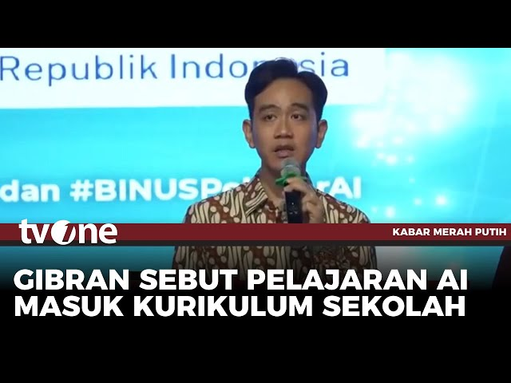

# Raising Children 🧑‍🧒‍🧒

## Who Outthink the Machines 🤖

**Zain Fathoni**
Senior Software Engineer at BookThatApp

---

<!-- Selamat sore, Usmar Imail! -->

---

<!--
Akhirnya, setelah belasan tahun menyaksikan panggung ini di layar kaca, saya bisa menirukan gaya para komika di sini.
Mari kita buktikan, apakah sesi ini jadi stand-up comedy? Atau malah stand-up meeting?
-->

---

## 👋 Introduction

<https://www.zainfathoni.com>

* :family: Parent of three :girl::boy::girl:
* :school: Homeschooling family :books:
* :hammer_and_wrench: Backend :arrow_right: Manager :arrow_right: Frontend :arrow_right: Fullstack
* :round_pushpin: Jember :arrow_right: Bandung :arrow_right: :singapore: SG :arrow_right: Jogja
* :airplane: Jogja :arrow_right: :malaysia: KL :arrow_right: :singapore: SG :arrow_right: :indonesia: Jakarta

---

---

## 🙋 Quick Survey

* Are you worried machines might take **your** jobs?
* Anyone here **raising children**?
* Are you worried machines might take **your kids'** jobs?

---

## AI Dilemma ⚖️: Dystopia 🤖 or Utopia 🌍?

There are two schools of thought about AI's future:

* **Dystopian**: AI will take over humanity
* **Utopian**: Humanity will survive and thrive

---

### 🛡️ The Path to Utopia

> The utopian future is possible—**but only if we raise resilient children.**

Human resilience has evolved throughout history:

- TV era → we adapted
- Internet era → we adapted
- Smartphone era → we adapted

**AI is the next chapter. But it requires something different from us.**

---

---

## Gen Alpha: Digital Natives Facing AI

### 📱 The Reality

Gen Alpha never knew life without screens—speech delays, attention spans, addiction are real.

But humanity adapted before. **We can adapt again.**

---

---

---

### 🔄 The Pattern

| Era             | Problem                 | Response                |
| --------------- | ----------------------- | ----------------------- |
| **TV**          | Attention-grabbing      | Set limits + content    |
| **Internet**    | Information overload    | Teach critical thinking |
| **Smartphones** | Addiction & distraction | Manage + model behavior |
| **AI**          | Cognition theft         | ???                     |

**The pattern:** Problem → Response → Resilience.

**The question:** What's our response to AI?

---

---

---

### 📖 Literacy

* 🌋 AI without literacy steals your thinking
* 🧠 Literacy = understanding, not outsourcing
* 📚 Books build the foundation AI can't replace

---

## 1️⃣ Digital & AI Literacy

### 📖 Literacy Starts with Intent

AI to skip thinking → cognitive atrophy

AI to understand better → real learning

**Literacy = knowing the difference.**

---

### 🎯 Know Your Tools: Learning Tools, Not Answer Machines

**Old way:**
Student → Textbook → Confusion → Give up

**With AI used correctly:**
Student → Ask AI → **Understand better** → Try again → **Own the learning**

**This is literacy:** Understanding how tools should be used.

---

### 🎓 Tools Designed for Learning

**ChatGPT Study Mode** and **Claude Learning Mode** are built for this:

- AI explains concepts multiple ways
- Guides learning, doesn't provide answers
- Students work at their own pace
- Designed to support, not replace, thinking

→ **Being literate means knowing these tools exist and how they work.**

---

## 2️⃣ Critical Thinking

### 🧠 Critical Thinking Matters Most

Not just knowing **what** is right, but **why**.

Can your child:

- Challenge the answer?
- Detect hidden assumptions?
- Ask a better question?

→ **This is what sets them apart from machines.**

---

### ✅ Teach the "Test the AI" Habit

1. Ask AI a question
2. **Stop and think:** Does this feel right?
3. Ask a follow-up: "What if you're wrong?"
4. Cross-check with another source
5. Form your own conclusion

→ **AI becomes a hypothesis generator, not a judge.**

---

## 3️⃣ Communication & Collaboration

### ⚠️ The AI Delusion Problem

AI is **confident even when wrong.**

Your child reads: "The capital of Indonesia is Surabaya" (wrong—it's Jakarta). They believed it.

**You can't avoid this. But parents can guide them.**

---

### 👨‍👩‍👧‍👦 AI Should Strengthen Family Bonds

**Wrong:** Kid uses AI alone → Parent unaware → Wrong answers believed

**Right:** Family asks AI together → Parent evaluates → Learn side-by-side

→ **Human connection + critical thinking together.**

---

### 💬 The Parent's Role: Evaluator, Not Answer Key

When your child says: "Based on AI…"

**Don't just accept or reject. Investigate together:**

- "Why did AI say that?"
- "Does this make sense to you?"
- "Let's find another source and compare"
- "What would be the impact if this was wrong?"

→ **You become their literacy partner, not their homework helper.**

---

---

## Live Demo

* Conference Date :x:
* Conference Family Trip :white_check_mark:

<!--
Siapa yang nggak kenal pasangan techbro-techsis ini?
Di IDSW 2025 ini, mereka Conference Date, lho!
Karena nggak mau kalah, saya ajak keluarga saya Conference Family Trip!
-->

---

## Live Demo: Learning in Action

### 🎤 Meet Najmi and Isa

My children will show you what this looks like in practice.

They're not actors. They're real kids figuring out how to deal with AI.

---

---

### 🧪 Najmi's Story: Testing AI Accuracy

**The Challenge:** Can you trust what ChatGPT tells you?

→ **This is AI Literacy in action.**

---

---

## 4️⃣ Problem Solving

### 💭 Isa's Story: Solving Problems Through Connection

**The Challenge:** Managing health and feelings across countries (Malaysia → Singapore)

→ **This is what AI can never do: be present with a child.\***

---

#### 🤖 Actually, AI can be present for humans

* :warning: But it might lead to delusion if unmonitored
* :point_up: That's why, children need to experience **real empathy** from **real humans**

---

## 5️⃣ Character & Agency

### 🛡️ Machines Can Be Trained, Humans Are Raised

Character is built through **real responsibilities** and clear values—not algorithms.

---

---

### 🎯 Nurture Agency

AI is **trained** to output. Humans are **raised** to choose.

**Becoming more human means:**

- Curious
- Resilient
- Thoughtful
- Kind

→ **These qualities come from agency, not grades.**

---

---

---

## 6️⃣ Creativity: Hands-On Work > Passive Consumption

AI can generate content. But only humans can truly create through practice and presence.

Examples from our family:

- **Isa's vlog** — narrative practice, storytelling decisions
- **Najmi's knitting** — tactile craft, patience, personal expression
- **Music performances** — live presence, practice, emotion

→ **These can't be outsourced to AI.**

---

## Key Takeaways

### 🎯 To Raise Kids Who Outthink the Machines

* 1️⃣ **Digital & AI Literacy** — Understand tools, use them correctly
* 2️⃣ **Critical Thinking** — Question everything, including AI
* 3️⃣ **Communication & Collaboration** — Learn together, not alone
* 4️⃣ **Problem Solving** — Systems thinking, not rules
* 5️⃣ **Character & Agency** — Protect their choices, their identity
* 6️⃣ **Creativity** — Hands-on work beats passive consumption

---

### 🚀 Your Challenge This Week

Pick **ONE** thing to try:

- A small AI project with your child
- A "test the AI" conversation
- One screen-free family discussion
- A problem-solving session together

→ **Start small. The goal is connection, not perfection.**

---

### 💭 Final Thought

> The future doesn't belong to the smartest machine.
> It belongs to the most **deeply human child**.

---

## 🙏 Thank You

🔗 [zainf.dev/raising-children](https://zainf.dev/raising-children)

