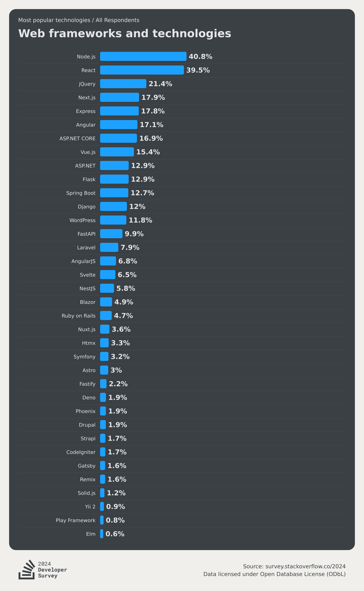
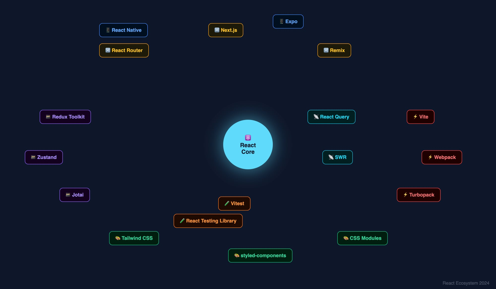

# Membangun Aplikasi Web & Mobile dengan **React + AI**

Lebih cepat, lebih praktis, tepat sasaran


<!--
TIMING: 2 menit

SPEAKER NOTES (Bahasa Indonesia):
Sapa audiens dengan hangat. Ucapkan Ramadan Mubarak — kita sedang TechRawih!
Sampaikan bahwa ini bukan sekadar intro React biasa. Kita akan bahas bagaimana cara yang dipakai developer-developer produktif hari ini: pakai React sebagai fondasi, AI sebagai akselerator.
Preview: "Di akhir sesi ini, kalian akan punya gambaran nyata bagaimana mulai bikin aplikasi web atau mobile, dan bagaimana AI bisa membantu prosesnya jadi lebih cepat dan lebih fokus."
-->

---

## 👋 Perkenalan


<https://www.zainfathoni.com/about>

- :round_pushpin: Jember → Bandung → :singapore: SG → Jogja
- :hammer_and_wrench: Backend → Manager → Frontend → Fullstack
- :robot: AI Enthusiast · Pembicara · Bapak Berdaya 🍠

<!--
TIMING: 2 menit

SPEAKER NOTES (Bahasa Indonesia):
Perkenalkan diri secara ringkas. Highlight perjalanan dari backend ke fullstack — ini relevan karena React adalah alat yang menjembatani banyak peran.
Sebutkan pengalaman dengan AI — bukan sekadar pakai ChatGPT, tapi mengintegrasikan AI ke dalam alur kerja sehari-hari.
Akhiri dengan: "Saya di sini bukan untuk ngajarin teori. Saya mau berbagi apa yang benar-benar berhasil di dunia nyata."
-->

---

## 🤔 Pertanyaan Pembuka

> Berapa lama waktu yang kamu butuhkan untuk bikin aplikasi dari nol?

<!--
TIMING: 3 menit

SPEAKER NOTES (Bahasa Indonesia):
Lempar pertanyaan ke audiens. Beri waktu 30 detik untuk mereka berpikir.
"Dua minggu? Sebulan? Atau bahkan belum pernah sampai selesai?"
Bangunan: "Sebagian besar developer habiskan 60-70% waktunya bukan untuk menulis logika bisnis, tapi untuk hal-hal yang repetitif — setup project, boilerplate, debugging typo, baca dokumentasi..."
Punchline: "AI tidak menggantikan developer. Tapi AI bisa mengambil alih bagian yang membosankan — supaya kamu fokus ke bagian yang bermakna."
Transisi: "Dan React adalah framework yang paling siap untuk kombinasi ini hari ini."

ENGAGEMENT TIP:
Tanya show of hands: "Siapa yang sudah pernah coba React?", "Siapa yang sudah pakai AI untuk coding?"
Ini membantu kamu membaca ruangan dan menyesuaikan kedalaman materi.
-->

---

## 📚 Agenda

1. **Kenapa React?** — Alat utama developer modern
2. **Fondasi React** — Konsep inti dalam 30 menit
3. **AI sebagai Asisten Coding** — Workflow yang mengubah segalanya
4. **Live Demo** — Membangun aplikasi nyata bersama
5. **Takeaways** — Langkah konkret yang bisa dimulai hari ini

→ **Target:** Pulang dengan skill baru + workflow baru

<!--
TIMING: 2 menit

SPEAKER NOTES (Bahasa Indonesia):
Walk through agenda dengan percaya diri. Tekankan bahwa ini bukan ceramah — ada demo live yang melibatkan audiens.
"Kita akan habiskan waktu terbesar di bagian demo — karena belajar coding itu harus dengan tangan."
Set ekspektasi: "Tidak perlu install apa-apa sekarang. Kalian bisa ikuti di layar saya, lalu coba sendiri di rumah malam ini."
-->

---

## 🌍 Kenapa React?

**React dipakai oleh:**

- Meta · Netflix · Airbnb · Shopify · Discord
- Tokopedia · Gojek · Traveloka · Bukalapak

→ **Bukan hanya perusahaan besar — tapi tim kecil dan freelancer juga**

<!--
TIMING: 3 menit

SPEAKER NOTES (Bahasa Indonesia):
Mulai dengan social proof yang relevan — nama perusahaan yang audiens kenal.
"Kenapa perusahaan-perusahaan ini pilih React? Bukan kebetulan. Ada alasan teknis dan bisnis di baliknya."
Tekankan: React bukan hanya untuk enterprise. Freelancer, startup, side project — semua bisa memanfaatkan ekosistem yang sama.
"Dan yang membuat React istimewa hari ini: komunitas dan tooling-nya sudah sangat matang untuk diintegrasikan dengan AI."
-->

---

## 📊 React di Dunia Developer



**Stack Overflow Survey 2024:**

- React: framework web paling populer **12 tahun berturut-turut**
- React Native: top 3 framework mobile

→ Ekosistem besar = **lebih banyak resource, library, dan jawaban di internet**

<!--
TIMING: 3 menit

SPEAKER NOTES (Bahasa Indonesia):
Gunakan data untuk memperkuat argumen. Popularitas bukan berarti harus selalu dipakai, tapi ada konsekuensi praktis: lebih banyak tutorial, lebih banyak library, lebih banyak developer yang bisa diajak kolaborasi.
Khususnya relevan untuk AI: "Model-model AI seperti Claude, GPT, Copilot — mereka di-training dengan miliaran baris kode React. Artinya AI lebih akurat dan lebih helpful ketika kamu pakai React dibanding framework yang lebih niche."
-->

---

## ⚛️ React itu Apa, Sih?

> React adalah **library JavaScript** untuk membangun antarmuka pengguna (UI)
> menggunakan **komponen yang bisa dipakai ulang**

**Konsep utama:**

- 🧩 **Component** — Potongan UI yang berdiri sendiri
- 🔄 **State** — Data yang bisa berubah
- ⬇️ **Props** — Data yang dikirim ke komponen
- 🔁 **Re-render** — UI otomatis update saat data berubah

<!--
TIMING: 5 menit

SPEAKER NOTES (Bahasa Indonesia):
Jelaskan dengan analogi yang familiar: "Bayangkan aplikasi seperti LEGO. React adalah sistemnya — setiap blok LEGO adalah komponen. Kamu bisa susun, copas, dan pakai ulang."
State: "State adalah memori komponen. Seperti otak — dia ingat berapa counter sekarang, apakah modal sedang terbuka, apa yang ada di keranjang belanja."
Props: "Props itu seperti instruksi yang kamu kasih ke komponen. 'Hei Button, teks kamu adalah Kirim, dan warnanya merah.'"
Re-render: "Yang bikin React istimewa — kamu tidak perlu manual update DOM. Saat data berubah, React yang urus tampilannnya."
-->

---

## 🧩 Komponen React — Contoh Sederhana

```jsx
// Komponen Kartu Produk
function ProductCard({ name, price, image }) {
  return (
    <div className="card">
      
      <h2>{name}</h2>
      <p>Rp {price.toLocaleString()}</p>
      <button>Tambah ke Keranjang</button>
    </div>
  )
}
```

→ **Satu komponen → bisa dipakai ratusan kali dengan data berbeda**

<!--
TIMING: 5 menit

SPEAKER NOTES (Bahasa Indonesia):
Walk through kode ini baris per baris. Jangan terlalu cepat.
"Perhatikan: komponen ini menerima `name`, `price`, dan `image` sebagai props."
"Di dalam, kita return JSX — ini seperti HTML tapi di dalam JavaScript."
"Kurung kurawal `{}` artinya 'masukkan nilai JavaScript di sini'."
Demo mental: "Kalau kita punya 100 produk, kita tinggal map data-nya dan render komponen ini 100 kali. Tidak perlu tulis HTML 100 kali."
Transisi ke AI: "Dan inilah yang bisa AI buat dengan sangat cepat — boilerplate seperti ini bisa di-generate dalam hitungan detik."
-->

---

## 🔄 State — Komponen yang Bisa Berubah

```jsx
import { useState } from 'react'

function Counter() {
  const [count, setCount] = useState(0)

  return (
    <div>
      <p>Hitungan: {count}</p>
      <button onClick={() => setCount(count + 1)}>
        Tambah
      </button>
    </div>
  )
}
```

→ **`useState` = cara React "mengingat" sesuatu antar render**

<!--
TIMING: 5 menit

SPEAKER NOTES (Bahasa Indonesia):
Ini adalah konsep paling penting di React — pastikan audiens mengerti.
"useState adalah hook paling sering dipakai. Formatnya selalu sama: `const [nilai, setNilai] = useState(nilaiAwal)`."
"`count` adalah nilai saat ini. `setCount` adalah fungsi untuk mengubahnya."
"Setiap kali `setCount` dipanggil, React akan re-render komponen dengan nilai baru."
Tanya audiens: "Ada yang punya pertanyaan tentang useState sebelum kita lanjut?"

TECHNICAL DEPTH:
useState adalah salah satu dari banyak hook React. Hook lain yang sering dipakai: useEffect (efek samping), useContext (state global), useRef (akses DOM langsung). Kita tidak akan cover semua hari ini — fokus ke yang paling penting dulu.
-->

---

## 🏗️ Struktur Aplikasi React

```text
my-app/
├── src/
│   ├── components/     ← Komponen yang bisa dipakai ulang
│   │   ├── Button.jsx
│   │   └── ProductCard.jsx
│   ├── pages/          ← Halaman aplikasi
│   │   ├── Home.jsx
│   │   └── Cart.jsx
│   ├── App.jsx         ← Komponen utama / root
│   └── main.jsx        ← Entry point
├── public/             ← Asset statis
└── package.json        ← Dependensi & scripts
```

<!--
TIMING: 3 menit

SPEAKER NOTES (Bahasa Indonesia):
"Ini adalah struktur tipikal proyek React modern. Tidak perlu hafal — AI akan bantu generate ini untuk kamu."
"Yang penting dipahami: ada pemisahan yang jelas antara komponen (bisa dipakai ulang) dan halaman (biasanya sekali pakai)."
"App.jsx adalah 'orchestrator' — di sinilah semua routing dan layout utama disusun."
Transisi: "Sekarang, bagaimana React bisa dipakai untuk mobile juga?"
-->

---

## 📱 React Native — Mobile dengan Skill yang Sama

```jsx
// Web (React)                    // Mobile (React Native)
<div>Halo Dunia</div>            <View>
<p>Ini paragraf</p>      →         <Text>Halo Dunia</Text>
<button>Klik</button>              <Text>Ini paragraf</Text>
                                   <TouchableOpacity>Klik</TouchableOpacity>
                                 </View>
```

**Sama:** Komponen, State, Props, Hooks, Logic bisnis

**Berbeda:** Komponen UI (native vs web), styling

<!--
TIMING: 4 menit

SPEAKER NOTES (Bahasa Indonesia):
"Ini yang membuat React investasi yang sangat efisien: skill-nya transfer ke mobile."
"React Native bukan compile web ke mobile — dia render komponen native sungguhan. Jadi performanya bagus."
"Perbedaan utama: div jadi View, p jadi Text, button jadi TouchableOpacity. Logic JavaScript-nya sama persis."
"Ini artinya kalian yang belajar React hari ini sudah punya fondasi untuk bikin aplikasi Android dan iOS juga."
Ekspektasi yang realistis: "Tentu ada kurva belajar tambahan untuk mobile-specific things: navigasi, permissions, push notification. Tapi fondasinya sudah ada."
-->

---

##



<!--
TIMING: 1 menit

SPEAKER NOTES (Bahasa Indonesia):
Ini adalah visual break. Tampilkan ekosistem React yang luas.
Komentar singkat: "Ekosistem React itu besar — kadang bikin overwhelmed. Tapi kabar baiknya: kamu tidak perlu tahu semua. Pelajari sesuai kebutuhan proyek."
Transisi ke AI: "Dan sekarang ada cara yang lebih cerdas untuk navigasi ekosistem ini — dengan bantuan AI."
-->

---

## 🤖 Masuk: AI sebagai Asisten Coding

**Sebelum AI:**

- Buka dokumentasi → Baca → Coba → Error → Google → Stack Overflow → Coba lagi

**Dengan AI:**

- Jelaskan yang kamu mau → Dapat draft kode → Review → Adjust → Done

→ **AI tidak menggantikan pemahaman — AI menghilangkan gesekan**

<!--
TIMING: 4 menit

SPEAKER NOTES (Bahasa Indonesia):
Ini adalah pivot talk yang penting. Set up dengan perbandingan yang kontras.
"Siapa yang pernah habiskan 2 jam hanya untuk cari cara format tanggal di JavaScript? *pause* Sekarang itu selesai dalam 30 detik."
"Tapi perhatikan: AI menghilangkan gesekan, bukan pemahaman. Kamu masih perlu mengerti kode yang AI hasilkan. Ini bukan magic — ini leverage."
Analogikan: "Dulu arsitek harus gambar manual setiap detail. Sekarang ada software. Tapi arsitek yang baik masih perlu tahu prinsip desain — software hanya accelerates."
-->

---

## 🛠️ AI Tools untuk Developer React

| Tool | Terbaik untuk | Gratis? |
|------|--------------|---------|
| **GitHub Copilot** | Autocomplete di editor | Trial 30hr |
| **Claude Code** | Refactor, analisis, multi-file | Free tier |
| **Cursor** | AI-native editor | Free tier |
| **v0 by Vercel** | Generate UI dari deskripsi | Free tier |
| **ChatGPT** | Q&A, debugging, penjelasan | Free |

→ **Pilih satu, kuasai dulu — jangan loncat-loncat**

<!--
TIMING: 4 menit

SPEAKER NOTES (Bahasa Indonesia):
Jangan overwhelm audiens dengan semua tool sekaligus. Rekomendasikan titik awal.
"Untuk pemula, saya rekomendasikan mulai dengan GitHub Copilot atau ChatGPT — paling mudah di-setup."
"Untuk yang sudah lebih advanced, Claude Code atau Cursor sangat powerful untuk project yang lebih besar."
"v0 by Vercel menarik untuk UI — kamu describe tampilan yang mau, dia generate React component-nya."
Poin penting: "Yang terpenting bukan tool-nya, tapi cara kamu berinteraksi dengan AI. Ini yang kita akan pelajari selanjutnya."
-->

---

## 💬 Seni Berbicara dengan AI

**Prompt yang buruk:**

> "Bikin aplikasi React"

**Prompt yang baik:**

> "Bikin komponen React bernama `ProductList` yang menerima array `products` sebagai props, menampilkannya dalam grid 3 kolom, dengan loading state dan empty state. Gunakan Tailwind CSS."

→ **Spesifik + konteks + output yang diharapkan = hasil yang akurat**

<!--
TIMING: 5 menit

SPEAKER NOTES (Bahasa Indonesia):
Ini adalah skill yang paling underrated dan paling impactful.
"AI bukan dukun — dia tidak bisa baca pikiran. Semakin spesifik kamu, semakin akurat hasilnya."
Walk through perbedaan kedua prompt: "Prompt buruk itu seperti pergi ke warung dan bilang 'kasih saya makanan'. Prompt yang baik: 'Satu nasi goreng spesial, tidak pedas, ekstra cabe hijau di pinggir, bungkus.'"
Formula: "Selalu sertakan: (1) nama komponen/fungsi, (2) input/output yang diharapkan, (3) library atau style yang dipakai, (4) edge cases yang perlu dihandle."
-->

---

## 🔄 Workflow AI-Assisted React

```
1. DEFINE   → Jelaskan ke AI apa yang mau dibangun
      ↓
2. GENERATE → AI buat draft pertama
      ↓
3. REVIEW   → Baca dan pahami setiap baris
      ↓
4. REFINE   → Minta AI perbaiki bagian yang kurang
      ↓
5. TEST     → Jalankan, lihat hasilnya
      ↓
6. ITERATE  → Ulangi sampai sesuai
```

→ **Kamu tetap pilot — AI adalah co-pilot**

<!--
TIMING: 4 menit

SPEAKER NOTES (Bahasa Indonesia):
Tekankan: ini bukan "copy paste dan jalan". Ini adalah proses iteratif.
"Langkah REVIEW adalah yang paling penting dan paling sering diskip orang. Jangan pernah skip review."
"Kenapa? Karena AI bisa salah. Dia bisa generate kode yang terlihat benar tapi punya bug tersembunyi, terutama di edge cases."
"Dengan memahami kode yang AI hasilkan, kamu juga belajar. Ini yang membuat AI menjadi tool belajar yang luar biasa, bukan crutch."
Transisi ke demo: "Sekarang kita lihat workflow ini dalam aksi nyata."
-->

---

## 🎯 Apa yang Kita Bangun Hari Ini

**🛒 Mini Shopping App**

- Daftar produk dari data dummy
- Keranjang belanja dengan state management
- Total harga otomatis
- Responsive layout

→ **Dari nol sampai jalan dalam ~30 menit dengan React + AI**

<!--
TIMING: 2 menit

SPEAKER NOTES (Bahasa Indonesia):
Set ekspektasi demo dengan jelas. Audiens perlu tahu apa yang akan mereka lihat.
"Kita tidak akan bikin yang sempurna — kita akan bikin yang fungsional. Ada bedanya."
"Focus kita bukan di styling atau animasi. Focus kita di logika React dan cara AI membantu prosesnya."
"Kalian bisa ikuti di layar — nanti slide-nya bisa diakses di link yang ada di akhir."
-->

---

## Step 1 — Setup Project

**Prompt ke AI:**

> "Buat project React baru dengan Vite. Berikan langkah-langkah setup dan struktur folder awal untuk aplikasi shopping cart sederhana."

```bash
# Yang AI akan arahkan:
npm create vite@latest mini-shop -- --template react
cd mini-shop
npm install
npm run dev
```

<!--
TIMING: 5 menit

SPEAKER NOTES (Bahasa Indonesia):
Jalankan perintah ini secara live. Tunjukkan bahwa Vite sangat cepat untuk setup.
"Dulu setup project React manual bisa makan waktu setengah jam. Sekarang dengan Vite, 2 menit sudah bisa coding."
"Perhatikan saya tidak langsung buka editor dan mulai coding — saya tanya AI dulu untuk get the lay of the land."
"AI tidak hanya kasih perintah — dia juga bisa jelaskan kenapa setiap step itu penting."

ACTION:
1. Buka terminal
2. Jalankan `npm create vite@latest mini-shop -- --template react`
3. Pilih framework: React, variant: JavaScript
4. `cd mini-shop && npm install && npm run dev`
5. Tunjukkan browser localhost:5173
-->

---

## Step 2 — Data Produk

**Prompt ke AI:**

> "Buatkan file `src/data/products.js` berisi array 6 produk dummy dengan field: id, name, price (dalam Rupiah), image (dari picsum.photos), dan category."

```js
// src/data/products.js — AI generate ini
export const products = [
  {
    id: 1,
    name: "Laptop Gaming Pro",
    price: 15000000,
    image: "https://picsum.photos/seed/laptop/300/200",
    category: "Electronics"
  },
  // ... 5 produk lagi
]
```

<!--
TIMING: 5 menit

SPEAKER NOTES (Bahasa Indonesia):
"Ini adalah langkah yang sering diabaikan developer pemula — mulai dari data, bukan dari UI."
"Dengan punya data yang jelas di awal, komponen kita jadi lebih mudah dirancang."
"Perhatikan saya pakai picsum.photos untuk gambar dummy — AI yang kasih saran ini karena dia tahu library yang biasa dipakai untuk prototyping."

ACTION:
1. Minta AI generate file products.js
2. Tunjukkan output AI
3. Buat file-nya di project
4. Tunjukkan di browser dengan console.log sederhana
-->

---

## Step 3 — Komponen ProductCard

**Prompt ke AI:**

> "Buat komponen React `ProductCard` yang menerima props: product (object) dan onAddToCart (function). Tampilkan gambar, nama, harga dalam format Rupiah, dan tombol 'Tambah ke Keranjang'. Gunakan inline style sederhana."

```jsx
// src/components/ProductCard.jsx — hasil AI
function ProductCard({ product, onAddToCart }) {
  const formatRupiah = (price) =>
    new Intl.NumberFormat('id-ID', {
      style: 'currency', currency: 'IDR', maximumFractionDigits: 0
    }).format(price)

  return (
    <div style={{ border: '1px solid #e2e8f0', borderRadius: 8,
      overflow: 'hidden', background: '#fff' }}>
      
      <div style={{ padding: 16 }}>
        <h3 style={{ margin: '0 0 8px', fontSize: 16 }}>{product.name}</h3>
        <p style={{ color: '#64748b', margin: '0 0 12px' }}>
          {formatRupiah(product.price)}
        </p>
        <button onClick={() => onAddToCart(product)}
          style={{ width: '100%', padding: '8px 16px', background: '#3b82f6',
            color: '#fff', border: 'none', borderRadius: 6, cursor: 'pointer' }}>
          Tambah ke Keranjang
        </button>
      </div>
    </div>
  )
}
```

<!--
TIMING: 8 menit

SPEAKER NOTES (Bahasa Indonesia):
"Ini adalah momen kita lihat AI bekerja untuk hal yang lebih kompleks."
"Perhatikan prompt saya sangat spesifik: nama komponen, props yang diterima, format harga, styling yang dipakai."
"Setelah AI generate, kita review bersama: apakah format Rupiah-nya benar? Apakah props sudah tepat? Apakah ada yang aneh?"
"Ini adalah latihan review yang sangat penting."

ACTION:
1. Copy prompt ke AI tool (live demo)
2. Tunjukkan output AI
3. Review kode bersama audiens — tanya "ada yang mau diubah?"
4. Copy ke src/components/ProductCard.jsx
5. Import dan render di App.jsx dengan satu produk dulu
6. Tunjukkan hasilnya di browser

ENGAGEMENT TIP:
Libatkan audiens: "Menurut kalian, format Rupiah-nya sudah benar belum? Ada yang bisa improve?"
-->

---

## Step 4 — State Keranjang Belanja

**Prompt ke AI:**

> "Tambahkan state `cart` ke App.jsx menggunakan useState. Buat fungsi `addToCart` yang menambah produk ke cart (jika sudah ada, tambah quantity). Buat komponen `CartSummary` yang menampilkan jumlah item dan total harga."

```jsx
// src/App.jsx — hasil AI
import { useState } from 'react'
import { products } from './data/products'
import ProductCard from './components/ProductCard'

function CartSummary({ cart }) {
  const total = cart.reduce((sum, item) => sum + item.price * item.qty, 0)
  const formatRupiah = (n) => new Intl.NumberFormat('id-ID',
    { style: 'currency', currency: 'IDR', maximumFractionDigits: 0 }).format(n)
  return (
    <div style={{ background: '#f0f9ff', padding: 16, borderRadius: 8 }}>
      🛒 {cart.reduce((sum, i) => sum + i.qty, 0)} item
      &nbsp;·&nbsp; Total: <strong>{formatRupiah(total)}</strong>
    </div>
  )
}

export default function App() {
  const [cart, setCart] = useState([])

  const addToCart = (product) => {
    setCart(prev => {
      const existing = prev.find(i => i.id === product.id)
      if (existing) {
        return prev.map(i => i.id === product.id
          ? { ...i, qty: i.qty + 1 } : i)
      }
      return [...prev, { ...product, qty: 1 }]
    })
  }

  return (
    <div style={{ maxWidth: 1000, margin: '0 auto', padding: 24 }}>
      <h1>🛍️ Mini Shop</h1>
      {cart.length > 0 && <CartSummary cart={cart} />}
      <div style={{ display: 'grid', gridTemplateColumns:
        'repeat(auto-fill, minmax(200px, 1fr))', gap: 16, marginTop: 24 }}>
        {products.map(p => (
          <ProductCard key={p.id} product={p} onAddToCart={addToCart} />
        ))}
      </div>
    </div>
  )
}
```

<!--
TIMING: 10 menit

SPEAKER NOTES (Bahasa Indonesia):
"Ini adalah bagian paling challenging — state management yang melibatkan logika bisnis."
"Keranjang belanja punya aturan: kalau produk sudah ada, jangan duplikat — tambah quantity-nya."
"Perhatikan bagaimana AI handle edge case ini. Kadang benar, kadang butuh di-refine."

ACTION:
1. Copy prompt ke AI tool
2. Tunjukkan bagaimana AI memecah masalah: state structure → addToCart function → CartSummary component
3. Review logika addToCart: apakah sudah handle duplikat dengan benar?
4. Integrate ke App.jsx
5. Test dengan klik beberapa produk
6. Tunjukkan CartSummary meng-update secara real-time

STORYTELLING:
"Perhatikan: kita tidak tulis satu baris logika keranjang ini sendiri. Tapi kita review dan paham setiap barisnya. Inilah AI-assisted engineering."
-->

---

## Step 5 — Finishing Touches

**Minta AI untuk:**

1. **Format harga** dengan `Intl.NumberFormat` yang benar
2. **Loading state** saat data pertama kali dimuat
3. **Empty state** saat keranjang kosong
4. **Responsive grid** untuk daftar produk

→ **AI bisa handle polish — kamu fokus ke product decisions**

<!--
TIMING: 8 menit

SPEAKER NOTES (Bahasa Indonesia):
"Ini adalah saat AI paling bersinar — detail-detail kecil yang butuh waktu tapi bukan core logic."
"Format Rupiah yang benar itu butuh `Intl.NumberFormat('id-ID', { style: 'currency', currency: 'IDR' })` — siapa yang hafal ini? AI hafal."
"Loading dan empty state adalah hal yang sering diskip developer buru-buru, padahal ini yang membuat aplikasi terasa polish dan profesional."
"Tunjukkan bagaimana request-request kecil ini di-handle AI satu per satu — ini real workflow, bukan magic."

ACTION:
1. Minta AI format Rupiah
2. Minta AI tambah loading state sederhana
3. Minta AI perbaiki grid jadi responsive
4. Hasil akhir: tunjukkan mini app yang berfungsi lengkap
-->

---

## 🎉 Hasil Demo

**Dalam ~30 menit kita sudah punya:**

- ✅ Setup project dengan Vite
- ✅ Data layer (produk dummy)
- ✅ Komponen reusable (ProductCard)
- ✅ State management (keranjang belanja)
- ✅ UI yang responsive

→ **Tanpa AI: estimasi 2-3 jam. Dengan AI: 30 menit.**

<!--
TIMING: 3 menit

SPEAKER NOTES (Bahasa Indonesia):
Berhenti sejenak dan appreciate apa yang sudah dicapai bersama.
"Ini bukan exaggeration — 30 menit tadi menggantikan pekerjaan yang dulu makan 2-3 jam, terutama untuk yang masih belajar."
"Yang lebih penting: kita tidak hanya copy-paste. Kita paham setiap bagiannya."
"Nah, sebelum kita tutup dengan takeaways, ada beberapa hal penting yang perlu kalian tahu supaya tidak jatuh ke jebakan yang sama dengan banyak developer."
-->

---

## ⚠️ Jebakan yang Harus Dihindari

1. **Tidak review kode AI** → Bugs tersembunyi di produksi
2. **Over-reliance** → Kamu jadi tidak bisa coding tanpa AI
3. **Prompt terlalu umum** → Output yang tidak berguna
4. **Skip testing** → "AI bilang benar" bukan jaminan

<!--
TIMING: 5 menit

SPEAKER NOTES (Bahasa Indonesia):
Ini adalah bagian penting — jangan dilewat karena "sudah hampir selesai".
"Saya pernah lihat developer yang copy-paste kode AI tanpa review dan deploy ke production. Hasilnya? Bug yang sangat memalukan karena error handling-nya kosong."
"Over-reliance: kalau kamu tidak bisa debug tanpa AI, itu tanda kamu perlu balik ke basics. AI adalah multiplier — dia tidak bisa multiply nol."
"Testing: AI bisa generate unit test juga, tapi tetap kamu yang harus pastikan test-nya meaningful, bukan hanya coverage palsu."
Pesan inti: "Pakai AI dengan sadar — bukan dengan buta."
-->

---

## 🧠 Cara Belajar React dengan AI

**AI sebagai tutor:**

> "Jelaskan useEffect kepada saya seperti saya developer junior yang baru belajar React. Berikan contoh kasus nyata."

**AI sebagai review partner:**

> "Review kode ini dan kasih feedback: apa yang bisa diperbaiki dari sisi performance, readability, dan best practices React?"

**AI sebagai debugging partner:**

> "Kode ini harusnya mengambil data dari API tapi malah infinite loop. Bantu saya debug."

<!--
TIMING: 5 menit

SPEAKER NOTES (Bahasa Indonesia):
"Ada tiga peran AI yang paling berguna untuk belajar React."
"Sebagai tutor: AI sabar tanpa batas, bisa dijelaskan berkali-kali dengan cara berbeda."
"Sebagai review partner: ini yang sering tidak dilakukan developer — minta AI review kode sebelum PR. Sangat efektif untuk menemukan masalah yang tidak kita sadari."
"Sebagai debugging partner: deskripsikan masalahnya, tunjukkan kodenya, tanyakan hipotesis. AI sangat baik untuk rubber duck debugging yang interaktif."
-->

---

## 🗺️ Peta Jalan Belajar React

```
MINGGU 1-2    MINGGU 3-4    BULAN 2        BULAN 3+
─────────────────────────────────────────────────
JSX &         State &       React Router   React Native
Components  → Props &    → API Fetch    → State Mgmt
              Events        Forms          Testing
              
              [AI membantu di setiap tahap]
```

→ **Konsisten 1 jam/hari lebih baik dari marathon 8 jam seminggu**

<!--
TIMING: 4 menit

SPEAKER NOTES (Bahasa Indonesia):
"Ini peta jalan yang realistis. Bukan yang tercepat, tapi yang paling sustainable."
"Minggu 1-2: jangan loncat ke hal-hal advanced dulu. Komponen dan JSX dulu sampai benar-benar nyaman."
"AI bisa membantu di setiap tahap — tapi kamu yang tentukan pace-nya."
"Tip: setiap hari coba build satu hal kecil. Counter, form, todo list. Small wins yang compound."
Realistis: "Belajar React butuh waktu. Tapi dengan AI sebagai learning partner, kurva belajarnya jauh lebih landai dari 5 tahun lalu."
-->

---

## 💡 Kesimpulan

1. 🧩 **React** adalah fondasi yang worth it — web + mobile, ekosistem matang
2. ⚛️ **Komponen + State + Props** adalah inti yang harus dikuasai
3. 🤖 **AI** menghilangkan gesekan, tapi bukan pengganti pemahaman
4. 💬 **Prompt yang baik** = hasil yang akurat = waktu yang hemat
5. 🔁 **Review, review, review** — jangan pernah skip langkah ini

→ **Mulai hari ini. Satu komponen. Satu prompt. Satu langkah.**

<!--
TIMING: 5 menit

SPEAKER NOTES (Bahasa Indonesia):
"Lima poin ini adalah inti dari semua yang kita pelajari hari ini."
Walk through setiap poin dengan singkat — ini bukan pengulangan, ini reinforcement.
"Yang paling penting dari semuanya adalah poin terakhir: mulai. Bukan besok. Bukan setelah selesai nonton tutorial 10 jam. Sekarang."
"Buka Vite, buka AI tool favorit kalian, dan build satu komponen kecil malam ini."
"Setiap developer senior yang kalian kagumi pernah ada di posisi yang sama — tidak tahu apa-apa. Perbedaannya hanya: mereka mulai."
-->

---

## 🚀 Langkah Pertama Malam Ini

**Quick wins (masing-masing < 30 menit):**

- ✅ Setup project React dengan Vite: `npm create vite@latest`
- ✅ Build komponen pertama: `Button` atau `Card` sederhana
- ✅ Coba satu prompt ke ChatGPT/Copilot untuk React
- ✅ Bookmark: [react.dev](https://react.dev) dan [vitejs.dev](https://vitejs.dev)
- ✅ Join komunitas: ReactID, Kelas Terbuka, atau Dicoding

→ **Pilih 2-3 untuk dilakukan malam ini**

<!--
TIMING: 3 menit

SPEAKER NOTES (Bahasa Indonesia):
"Ini bukan daftar yang harus kalian selesaikan semua. Pilih 2-3 yang paling feasible malam ini."
"React.dev adalah dokumentasi resmi yang sangat bagus — interactive, ada playground, ada step-by-step tutorial."
"Join komunitas itu penting — karena learning alone itu susah. Ada orang lain yang struggle dengan hal yang sama dan bisa saling bantu."
Call to action: "Raise your hand kalau mau commit untuk build satu React component malam ini."
-->

---

## 🙏 Terima Kasih!

**Zain Fathoni** · [zainfathoni.com](https://zainfathoni.com)

🔗 **Slides:** [zainf.dev/react-with-ai-assistance](https://zainf.dev/react-with-ai-assistance)


💡 *"The best time to start learning React was 5 years ago. The second best time is now — with AI by your side."*

<!--
TIMING: 3 menit

SPEAKER NOTES (Bahasa Indonesia):
"Terima kasih sudah meluangkan waktu di bulan Ramadan yang penuh berkah ini untuk belajar bersama."
"QR code ini akan bawa kalian langsung ke slide presentasi ini — bisa diakses kapan saja, termasuk untuk review materi tadi."
"Kalau ada pertanyaan yang tidak sempat ditanyakan, kalian bisa reach out lewat link di slide."
"Selamat coding, selamat berpuasa, dan semoga ilmu yang kita dapat hari ini bermanfaat. Wassalamualaikum."
-->
