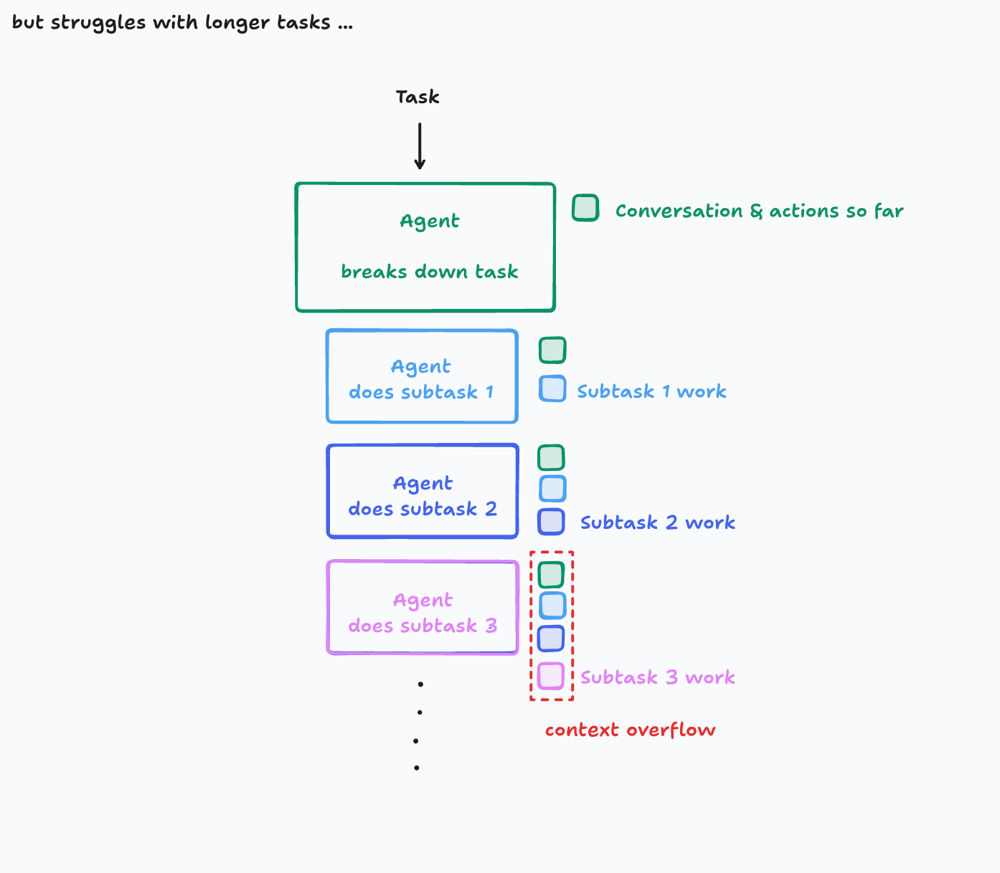
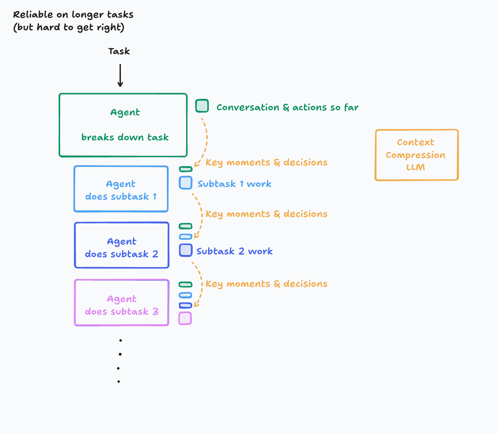

# Writing Reliable Tests for React using AI

A comprehensive guide to building robust test suites with AI assistance

---

## Introduction

<https://www.zainfathoni.com/about>

---

## AI Usage Principles

- Use AI to **enhance** your productivity
- Be the **pilot**, not the passenger
- Iron Man **suit**, not ~~robot~~ :robot:
- <https://x.com/zainfathoni/status/1938256445663023244>

---

## Context 🤯

---

## Context 🛠️

---

## Agenda

1. **Prepare React Testing Infrastructure**
2. **Write reliable tests for React components**
3. **Use AI to write the tests**
4. **Prompt AI to produce consistent tests**

---

## 1. Prepare React Testing Infrastructure

- 🛠️ React Testing Library
- 🌐 Vitest Browser Mode
- 🎭 Playwright MCP integration

---

## 2. Write reliable tests for React components

- ✅ Test user interactions
- ❌ Avoid testing implementation details
- <https://confident-react-testing.netlify.app/>

---

## 3. Use AI to write the tests

- :robot: Leveraging AI for test generation
- :hand: Understanding AI capabilities
- :gear: Integrating AI into testing workflow
- :repeat: Quality assurance with AI-generated tests

---

## 4. Prompt AI to produce consistent tests

- :brain: Establishing testing standards
- :pencil: Document repeated patterns
- :robot: Generate test plans based on examples
- :one: Focuse on one test suite at a time

---

## Key Takeaways

- 🚀 **Be the pilot, not the passenger** - AI enhances, doesn't replace
- 🧠 **Manage context carefully** - Avoid overflow, maintain relevance
- 🛠️ **Modern stack**: React Testing Library + Vitest + Playwright MCP
- 🎯 **Test behaviors, not implementation** - User-focused testing
- 📝 **Document patterns** - Guide AI with consistent standards

---

## Thank You

<https://zainf.dev/reliable-tests-with-ai>
