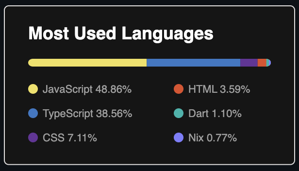
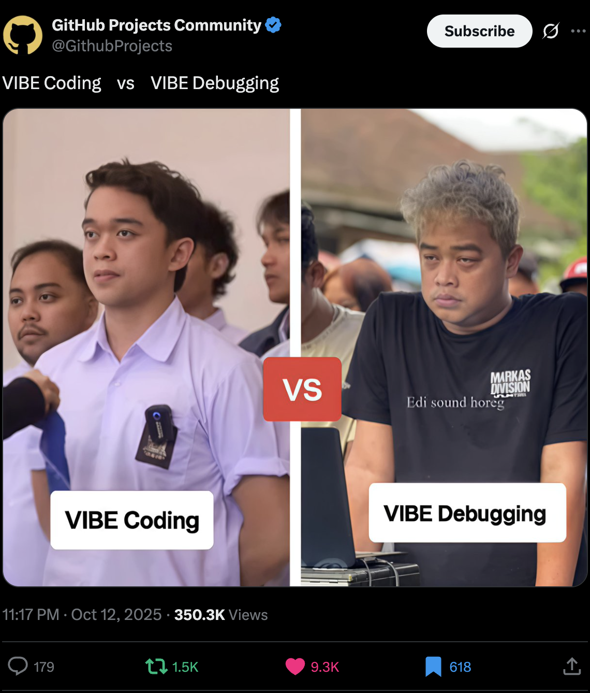

# Think in JS, Code in Python — with AI

### Zain Fathoni

🧠 → 💬 → 🐍

> _What if your brain spoke React, but your runtime spoke Python?_

<!--
TIMING: 15-20 seconds

SPEAKER NOTES (Bahasa Indonesia):
"Halo, saya Zain. Dan saya ingin mulai dengan pertanyaan yang sudah menggelitik pikiran saya selama setahun terakhir.

[Tunjuk ke subtitle]

Bagaimana kalau otak Anda berbicara React, tapi runtime Anda berbicara Python?

[Pause]

Pertanyaan inilah yang mengubah cara saya berpikir tentang belajar bahasa pemrograman baru."

NOTES FOR YOU:
- This opening question is the hook—let it land
- Make eye contact, slow delivery
- The 🧠 → 💬 → 🐍 icon should be on screen or visible
- Pause after the question (let audience think)
-->

---



---

## Why This Talk?

- I’ve been a JS/TS dev for years — React, Node.js, Remix, etc.
- Recently I’ve been working in the backend parts of the stack.
  - Ruby on Rails
  - Python for data tasks
- I noticed something interesting:
  > My **thoughts** stayed in JS...  
  > but I could **code** in Python — with AI bridging the gap.

<!--
TIMING: 45-60 seconds

SPEAKER NOTES (Bahasa Indonesia):
"Saya sudah menjadi developer JavaScript selama bertahun-tahun. React, TypeScript, Remix, Tailwind—itu adalah zona nyaman saya.

Tapi baru-baru ini, saya mulai bekerja di sisi lain dari stack. Ruby on Rails. Python untuk tugas-tugas data. Backend work.

Dan ini yang saya perhatikan: [pause]

Cara saya berpikir tetap dalam JavaScript. Components, state, maps, async flows—saya masih berpikir dalam pola React.

Tapi saya harus menulis code dalam Python.

Dan di situlah keajaiban terjadi. Karena daripada menghabiskan berminggu-minggu untuk belajar syntax Python, saya hanya... mendeskripsikan apa yang saya inginkan dalam istilah React, dan AI memberi saya code Python yang bekerja.

Dan itu mengubah segalanya."

TECHNICAL DEPTH:
- This establishes your credibility as a React expert
- The key insight: your THINKING (patterns) didn't change, only the SYNTAX
- This is the central thesis
- Emphasize the word "patterns" mentally for audience priming

ENGAGEMENT TIP:
- After "And that's where the magic happened" — pause for effect
- Let audience anticipate the revelation
-->

---

## 🧭 The Old Way: Learn, Then Code

1. Pick a new language 🐍
2. Spend a day or two reading syntax guides 📖
3. Watch tutorials, memorize keywords
4. _Then_ finally try building something

```python
for i in range(10):
    print(i)
```

> “I used to treat every new language like a textbook subject.”

<!--
TIMING: 60-75 seconds

SPEAKER NOTES (Bahasa Indonesia):
"Mari kita mulai dengan cara kita dulu melakukan ini. Cara saya dulu melakukannya.

Ketika saya ingin belajar bahasa pemrograman baru, playbook-nya selalu sama:

[Tunjuk ke langkah-langkah]

1. Pilih bahasa baru
2. Habiskan sehari atau dua membaca syntax guides—loops, lists, functions, semua fundamentals
3. Tonton tutorial, hafal keywords
4. Kemudian—akhirnya—coba membangun sesuatu yang nyata

[Tunjuk ke code example]

Ini adalah cara lama. Dan itu lambat. Terasa seperti sekolah. Seperti saya harus lulus tes syntax sebelum saya dapat hak untuk membangun.

Kita semua pernah melakukan ini. Ini jalur tradisional. Dan itu berhasil. Tapi ada frictionnya."

TECHNICAL DEPTH:
- The "learn syntax FIRST, build LATER" model is the traditional pedagogy
- This friction is the problem we're about to solve
- Audience recognition: "That's me!" moments during this slide

ENGAGEMENT TIP:
- Ask: "Siapa di sini yang pernah melakukan ini?" (Who here has done this?)
- Wait for audience to nod/raise hands
- This creates buy-in for the next slide's solution

STORYTELLING:
- Make it relatable—everyone has experienced this friction
- Use your own frustration voice
-->

---

## ⚡ The New Way: Code, Then Learn

Now it’s flipped.

1. I start with an **idea**, not syntax.
2. I describe what I want in **my native language (JS thinking)**.
3. AI gives me **working code** in the new syntax.
4. I learn _by doing_ — not memorizing.

```text
Me: “Fetch some data, map over it, display the names.”
AI: *Writes Python for me.*
```

> “AI turned syntax learning into _syntax osmosis_.”

<!--
TIMING: 60-75 seconds

SPEAKER NOTES (Bahasa Indonesia):
"Tapi sesuatu berubah. Bagaimana kalau kita balik-balik ini?

[Tunjuk ke urutan baru]

Sekarang saya mulai dengan ide. Bukan syntax. Sebuah ide.

Saya mendeskripsikan apa yang saya inginkan dalam bahasa asli saya—pemikiran JavaScript, pola React.

AI memberi saya code yang bekerja dalam syntax baru.

Dan saya belajar dengan melakukan.

[Tunjuk ke code example]

Daripada 'Fetch some data' menjadi pelajaran syntax, itu menjadi program yang bekerja. Saya melihat Python. Saya memahaminya dalam konteks. Saya belajar pola, bukan menghafal keywords.

Ini berbeda. Ini 'code first, learn by doing.'

Dan saya menyebutnya syntax osmosis—Anda menyerap bahasa melalui konteks, bukan textbooks."

TECHNICAL DEPTH:
- This is the core insight: flipping the pedagogy
- Instead of syntax → understanding → building
- Now it's: idea → code → pattern understanding
- Syntax osmosis is learned, not memorized

ENGAGEMENT TIP:
- Ask rhetorically: "Berapa orang di sini pernah belajar with AI ini?" (How many of you have learned with AI like this?)
- Pause for reactions
- This validates the concept for skeptics

STORYTELLING:
- Emphasize the shift from passive (learning syntax) to active (building, then understanding)
- This is more engaging than traditional education
-->

---

## 🧩 From Syntax → Semantics

We used to learn **how to write code.**  
Now we can focus on **how to think code.**

🧠💬🐍

<!--
TIMING: 30-40 seconds

SPEAKER NOTES (Bahasa Indonesia):
"Pergeseran ini halus tapi mendalam.

Cara lama tentang belajar syntax—mekanik bagaimana menulis code.

Cara baru tentang berpikir code—semantik, konsep, pola.

Karena ini adalah kebenaran: [pause]

Jika Anda dapat berpikir dalam pola, syntax hampir tidak relevan. Itu hanya terjemahan."

TECHNICAL DEPTH:
- Syntax is a surface-level implementation detail
- Patterns are the underlying universal concepts
- This distinction is THE KEY to the entire talk
- All human programming eventually converges on the same patterns

ENGAGEMENT TIP:
- The pause before "If you can think in patterns" is critical
- Let audience anticipate the insight
- This is the philosophical bridge to the next section

STORYTELLING:
- This is the thesis statement for everything that follows
- Return to this idea during the demo and conclusion
-->

---

## The Core Idea

**JS is how I _think_.** **Python is how I _ship_.** **AI is how I _bridge_.**

🧠 → 💬 → 🐍

<!--
TIMING: 40-50 seconds

SPEAKER NOTES (Bahasa Indonesia):
"Ini adalah tesis. Ide inti dari pembicaraan ini.

[Tunjuk ke setiap baris]

JavaScript adalah cara saya berpikir—pola React, async/await, composition. Itu adalah bahasa pemikiran asli saya.

Python adalah cara saya ship—ecosystem yang kaya, library data, cepat ke production, bagus untuk backend work.

Dan AI adalah jembatan. Ini menerjemahkan di antara keduanya.

Icon ini [🧠 → 💬 → 🐍] akan berada di foto di suatu tempat, jadi biarkan itu masuk.

Masa depan bukan belajar 10 bahasa. Ini belajar pola sekali, dan membiarkan AI menerjemahkannya di mana-mana."

TECHNICAL DEPTH:
- Think = mental model, problem-solving approach
- Ship = execution environment, production needs
- Bridge = AI as translator, not replacement for either
- This is universal: works for any thinking language + target runtime

ENGAGEMENT TIP:
- Make this memorable—audience will quote this
- The 🧠 → 💬 → 🐍 icon should be large on screen
- Pause for this slide to sink in
- This is quotable—expect photos

STORYTELLING:
- This is the ONE-LINER of your talk
- Everything before proves it, everything after applies it
- Return to this formula in the conclusion
-->

---

## 🎯 Patterns Over Languages

```
useState() exists in:
  ✓ React (JavaScript)
  ✓ Vue (JavaScript)
  ✓ Svelte (JavaScript)
  ✓ Flutter (Dart)
  ✓ Android Jetpack (Kotlin)
```

**The pattern is universal. The syntax is incidental.**

<!--
TIMING: 45-60 seconds

SPEAKER NOTES (Bahasa Indonesia):
"Sebelum kita masuk ke demo, penting untuk memahami ini:

[Tunjuk ke list]

Konsep 'state management'—pattern yang React populerkan—itu ada di mana-mana.

Vue punya itu. Svelte punya itu. Bahkan Flutter di Dart punya semacam itu.

Apa arti ini?

[Pause]

Ini berarti pola tersebut universal—independen dari bahasa pemrograman.

Hanya syntaxnya yang berbeda.

Ini adalah kunci untuk semua ini. Pola yang kita pelajari sebagai developer React? Mereka tidak terikat pada JavaScript. Mereka adalah konsep abstrak yang dapat diimplementasikan di mana saja.

Dan itu berarti AI dapat menerjemahkannya."

TECHNICAL DEPTH:
- This proves patterns are language-agnostic
- Gives scientific credibility to the concept
- Paves the way for the demo (it's not magic, it's just translation)
- Shows the future: learn patterns once, use everywhere

ENGAGEMENT TIP:
- This is the "Aha!" moment before the demo
- Audience now understands what they're about to see
- They'll view the demo as pattern translation, not programming magic

STORYTELLING:
- This bridges the philosophical (Syntax vs. Semantics) to the practical (the demo)
- Primes audience to watch for patterns in the code, not syntax
-->

---

## What if AI Could Bridge the Gap?

```jsx
<App>
  <Header title="Chat Dashboard" />
  <MessageList messages={messages} />
  <InputBox onSend={handleSend} />
</App>
```

**↓ AI Translation ↓**

> "Turn this React-style structure into a Python Streamlit app."

<!--
TIMING: 20-30 seconds

SPEAKER NOTES (Bahasa Indonesia):
"Apa jika saya bisa hanya mendeskripsikan mental model React saya, dan AI menerjemahkannya ke Python?

[Tunjuk ke JSX code]

Inilah yang saya pikirkan. Itu adalah struktur React klasik.

[Tunjuk ke prompt]

Dan inilah yang saya katakan ke Claude Code. Hanya deskripsi sederhana dalam bahasa saya.

[Pause]

Itu saja. Itu adalah seluruh ide.

Saya memberikan AI intent saya dalam istilah React. AI mengembalikan code Python yang bekerja.

Dan inilah yang saya sadari: Saya tidak perlu mempelajari syntax Streamlit terlebih dahulu. Saya hanya perlu mendeskripsikan apa yang saya inginkan, dan Claude mengisinya.

Mari saya tunjukkan kepada Anda apa yang terjadi."

TECHNICAL DEPTH:
- This shows the INPUT (React mental model)
- The prompt shows the TRANSLATION REQUEST
- Sets up for the magic moment: AI generates Python

ENGAGEMENT TIP:
- Point to JSX: "This is how I think"
- Point to prompt: "This is what I say to AI"
- Pause before showing the result
-->

---

## AI Generates the Code

```python
import streamlit as st

st.title("Chat Dashboard")

messages = st.session_state.get("messages", [])

for m in messages:
    st.write(m)

new_message = st.text_input("Type your message:")

if st.button("Send"):
    messages.append(new_message)
    st.session_state["messages"] = messages
```

<!--
TIMING: 60-75 seconds

SPEAKER NOTES (Bahasa Indonesia):
"Dan inilah yang AI generate dari deskripsi React saya.

[Tunjuk ke imports]

Saya tidak perlu tahu 'import streamlit as st.' AI tahu sendiri.

[Tunjuk ke st.title()]

st.title adalah cara Streamlit untuk mengatakan <Header />. AI menerjemahkannya.

[Tunjuk ke session_state]

st.session_state adalah jawaban Streamlit untuk useState. AI mengenali ini dari mental model React saya.

[Tunjuk ke for loop]

The for loop adalah bagaimana Streamlit render things—iterate dan call st.write(). Itu adalah terjemahan dari map().

[Tunjuk ke button logic]

The button dan rerun adalah terjemahan dari onClick dan re-render.

Inilah kuncinya: [pause]

Saya tidak berpikir dalam Streamlit. Saya berpikir dalam React. AI melakukan terjemahan.

Saya tidak menghafal Streamlit docs. Saya mendeskripsikan pola.

Dan semua yang saya butuhkan—imports, boilerplate, framework idioms—AI mengisinya secara otomatis."

TECHNICAL DEPTH:
- Show the line-by-line translation
- Each Streamlit construct maps to a React concept
- Boilerplate (imports) is automatic—no memorization needed

ENGAGEMENT TIP:
- Point at each line deliberately
- Pause before the summary (3-5 seconds)
- Let the translation sink in
-->

---

## 🔥 Same Mental Model, Different Ecosystem

| React Concept  | Python Implementation | AI's Role                        |
| -------------- | --------------------- | -------------------------------- |
| Component tree | Sequential layout     | Maps structure → imperative flow |
| `useState()`   | `st.session_state`    | Manages persistence              |
| JSX            | Function calls        | Translates declarative syntax    |
| CSS            | Markdown + HTML       | Translates styling intent        |

<!--
TIMING: 60-75 seconds

SPEAKER NOTES (Bahasa Indonesia):
"Tabel ini adalah mental model anchor Anda. Ingat ini.

[Tunjuk ke setiap row]

Di React, saya berpikir dalam component trees. Di Python/Streamlit, itu adalah sequential function calls. Sama intent, berbeda execution model. AI menerjemahkan.

useState di React menjadi st.session_state di Streamlit. Pola yang sama—'Saya butuh persistent state'—nama berbeda. AI tahu ini.

JSX adalah declarative markup. Function calls adalah imperatif. Tetapi mereka mengekspresikan hal yang sama. AI melihat melampaui syntax ke intent.

CSS adalah styling intent. st.markdown() dengan HTML/CSS adalah styling implementation. Syntax berbeda, desire yang sama: 'Buat ini terlihat seperti cara tertentu.' AI mengisi celahnya.

[Pause]

Tabel inilah mengapa semuanya berhasil. Pola ada independen dari bahasa. AI hanya menerjemahkan surface syntax."

TECHNICAL DEPTH:
- This is the anchor for remembering the concepts
- Each row shows the pattern independence from syntax
- Drives home the thesis

ENGAGEMENT TIP:
- Let them absorb each row
- Don't rush through the table
- The pause before the final statement is crucial
-->

---

## 💻 Live Demo Time

**Starting from a blank template with React references.**

**Goal:** Build a chat dashboard using Streamlit
**Mindset:** React
**Language:** Python
**Tool:** Claude Code (AI pair-programmer)

🧠 → Show React code → 💬 Describe intent → 🤖 Let AI translate → ⚙️ Run it live

<!--
Notes: Outline the game plan before typing (30s).

SETUP (before this slide):
- Terminal open, ready to run `streamlit run app.py`
- Browser ready to view localhost:8501
- Claude Code open and visible to audience
- Have React reference files visible for each step (in separate tabs/editor)
  - react_step_1_basic.jsx
  - react_step_2_timestamps.jsx
  - react_step_3_styled.jsx
- Have REACT_REFERENCE_GUIDE.md as reference

FLOW:
1. Intro (current slide): "We're thinking in React, coding in Python with AI assistance. Starting from a blank template."
2. Show app.py running (10s): "This is my starting point—a blank boilerplate ready to build"
3. Go back to slides for Step 1 - show React reference and live-code
-->

---

## Step 1 — Live Code the Intent

**React Reference: `react_step_1_basic.jsx`**

> "Build a simple chat dashboard with state, rendering, and send button."

<!--
Notes: Show React thinking BEFORE code (1-2 min), then live-code (3-4 min).

SPEAKER NOTES:
"Look at this React code in react_step_1_basic.jsx. I'm thinking about this as three components:
- A <Header /> showing 'Chat Dashboard'
- A <MessageList /> that maps over messages from state
- An <InputBox /> with an onClick send handler

This is how my brain works. Now let's translate it to Python."

ACTION:
1. SHOW the React file to audience (or have it visible on screen)
   - Point to: useState([]), messages.map(), onClick handlers
   - Say: "This is my mental model—stateful, functional, reactive"

2. Then describe to Claude Code (make visible):
   "Look at react_step_1_basic.jsx.
   - useState([]) → st.session_state for messages
   - messages.map() → for loop in Python
   - onClick + onKeyPress → st.button() + st.text_input()

   Build this same logic in app.py using Streamlit."

3. Claude generates code → copy to app.py
4. Save → Streamlit auto-reloads → show it working
5. Point out the mappings side-by-side:
   - React: useState([]) | Python: if "messages" not in st.session_state
   - React: messages.map(msg => ...) | Python: for msg in st.session_state.messages
   - React: st.button() + st.rerun() | Python: onClick + re-render

React→Python Mappings to Highlight:
- `useState([])` → `st.session_state`
- `.map()` → `for` loop
- `onClick` + `onKeyPress` → `st.button()` + `st.text_input()`
- `.append()` → state update + `st.rerun()`

TIMING: ~4-5 minutes total (show intent, get code, demo, explain mappings)

EXTENDED DEMO NOTES (12-15 min total for all 3 steps):
- Always compare React code to Python result side-by-side
- Emphasize: "Same pattern, different syntax"
- If something works perfectly, celebrate it—show audience the working code
- If there are errors, use them as teaching moments: "Look how AI errors are helpful"
- Don't rush—this is the centerpiece of your 30-minute talk
- Audience sees the THINKING process, not just the final code
-->

---

## Step 2 — Add Timestamps & Newest-First

**React Reference: `react_step_2_timestamps.jsx`**

> "Enrich state with timestamps and show newest messages first."

<!--
Notes: Show state enrichment thinking (1 min), then switch to backup or live-code (2-3 min).

SPEAKER NOTES:
"In React, when I enrich state from simple strings to objects, I add properties.
Look at react_step_2_timestamps.jsx—I'm adding a timestamp property.
Then I display it using reversed() — just like calling array.reverse() before map().

This is state enrichment, a fundamental pattern in React. Now let's see it in Python."

ACTION (choose one):

OPTION A - Live coding (if Step 1 went smooth):
1. SHOW react_step_2_timestamps.jsx to audience
   - Point to: { text, timestamp } object structure
   - Point to: [...messages].reverse().map()
   - Say: "Same pattern, just richer data"

2. Say out loud: "I need to enrich my state structure with timestamps"
3. Paste to Claude Code (visible):
   "Look at react_step_2_timestamps.jsx.
   I want to store messages as objects with {text, timestamp} properties.
   Display them as 'HH:MM:SS — message text'.
   Show newest messages first (like reversing array before map).

   Update app.py with this same logic."

4. Claude generates → copy to app.py
5. Save → Streamlit auto-reloads
6. Send a message → shows timestamp
7. Point to the code side-by-side:
   React: { text, timestamp } object
   Python: {"text": new_message, "timestamp": datetime.now().strftime("%H:%M:%S")}
   "Same structure, different syntax"

   React: [...messages].reverse().map()
   Python: reversed(st.session_state.messages)
   "Same pattern—reverse then iterate"

OPTION B - Switch to backup (safer for timing):
1. In terminal: Ctrl+C
2. Run: streamlit run app_v2_timestamps.py
3. Show the updated app with timestamps
4. Point to the same code sections and React patterns

React→Python Mappings to Highlight:
- Rich state objects: `{ text, timestamp }` → dict with keys
- `new Date().toLocaleTimeString()` → `datetime.now().strftime("%H:%M:%S")`
- `[...arr].reverse().map()` → `reversed(st.session_state.messages)` in for loop
- Accessing properties: `msg.timestamp` → `msg_obj["timestamp"]`

TIMING: ~3-4 minutes total

EXTENDED DEMO TACTICS:
- Show React file and Python result side-by-side
- Specifically highlight: "Look at this structure—it's the reversed() function, just like array.reverse() in React"
- Emphasize: "The pattern is universal. Only syntax changes."
- If live-coding: point out where you got stuck, ask Claude, show the thinking process

FALLBACK: If something breaks:
"Ini kenapa kita punya version control! Mari saya tunjukkan versi yang sudah selesai."
(This is why we have version control! Let me show you the completed version.)
-->

---

## Step 3 — Visual Polish with Styling

**React Reference: `react_step_3_styled.jsx`**

> "Add conditional styling with component extraction and role-based bubbles."

<!--
Notes: Show component extraction thinking (1 min), then show or live-code (2-3 min).

SPEAKER NOTES:
"Now I'm adding conditional styling and component extraction.
Look at react_step_3_styled.jsx—I have a MessageBubble component with conditional className.
Like className={isUser ? 'user' : 'assistant'} in React.

Let's translate this component pattern to Python."

ACTION (choose based on time/confidence):

OPTION A - Live coding (if time allows):
1. SHOW react_step_3_styled.jsx to audience
   - Point to: MessageBubble component with props
   - Point to: Conditional className based on role
   - Point to: CSS-in-JS or inline styles
   - Say: "Same component thinking—different syntax"

2. Say: "I want to extract message rendering into a function with conditional styling"
3. Paste to Claude Code (visible):
   "Look at react_step_3_styled.jsx.
   Create a render_message() function (like the MessageBubble component).
   Add conditional styling for user vs assistant:
   - User messages: green bubbles (#DCF8C6), right-aligned
   - Assistant messages: gray bubbles (#E8E8E8), left-aligned
   Like className={isUser ? 'user' : 'assistant'} in React.
   Use st.markdown() with inline HTML/CSS.

   Update app.py with this component function."

4. Claude generates → copy to app.py
5. Save → Streamlit reloads
6. Send messages as both User and Assistant → see styled bubbles
7. Point to the code side-by-side:
   React: function MessageBubble({ role, text, timestamp }) { ... }
   Python: def render_message(timestamp: str, text: str, role: str) -> None: ...
   "Same pattern—function/component receives props/parameters"

   React: className={isUser ? 'user' : 'assistant'}
   Python: color = "#DCF8C6" if is_user else "#E8E8E8"
   "Conditional styling—same logic, different expression"

OPTION B - Switch to backup (recommended for timing):
1. In terminal: Ctrl+C
2. Run: streamlit run app_v3_styled.py
3. Show the fully styled chat app
4. Demo the role toggle: send as "User", then as "Assistant"
5. Point to render_message() function as component extraction

React→Python Mappings to Highlight:
- Component: `<MessageBubble props />` → `render_message(args)` function
- Conditional classnames: `isUser ? 'bubble--user' : 'bubble--assistant'` → ternary inline CSS
- Inline styles: `style={{backgroundColor: color}}` → `f"style='background-color: {color}'"`
- Props: `role={msg.role}` → function parameter
- Select/dropdown: `<select onChange>` → `st.radio()`

TIMING: ~3-4 minutes total

EXTENDED DEMO TACTICS:
- After bubbles render, take a moment to let the visual polish land
- "Lihat ini—tidak ada syntax memorization. Hanya intent + AI translation."
- (Look at this—no syntax memorization. Just intent + AI translation.)
- Point to specific lines:
  - color = "#DCF8C6" if is_user else "#E8E8E8"
  "Ini adalah conditional styling dari React className={...?...:...}"
- Emphasize: "I never memorized st.markdown(). I just described the component pattern, and AI translated it."

KEY POINT TO EMPHASIZE (Bahasa Indonesia):
"Saya tidak pernah menghafal bagaimana st.markdown() bekerja.
Saya mendeskripsikan konsepnya (component extraction, conditional styling seperti React),
dan Claude menerjemahkannya ke Python idioms."
-->

---

## Demo Recap

- I didn't think in syntax — I thought in _patterns_.
- AI handled the language translation.
- I still designed architecture like a JS dev.

<!--
TIMING: 45 seconds

SPEAKER NOTES (Bahasa Indonesia):
"Apa yang baru saja terjadi?
- Saya mulai dengan React mental models: components, state, maps, conditionals
- Saya mendeskripsikan konsep-konsep itu dalam bahasa sederhana
- Claude Code menerjemahkannya ke Python idioms
- Kami pergi dari ide ke aplikasi yang berjalan, styled, dalam sekitar 8 menit

Dan inilah kuncinya: saya tidak pernah menghafal syntax Python. Saya hanya berbicara tentang pola."

ACTION:
1. Quick glance at the app running in browser (still visible?)
2. Ask rhetorically: "Apakah saya perlu tahu Python sebelum ini?" (Did I need to know Python before this?)
3. Answer: "Tidak. Saya hanya perlu tahu pola React. Bahasanya adalah incidental."
4. Transition: "Ini adalah apa yang terjadi ketika Anda membiarkan AI mengabstrak bahasa..."
-->

---

## What This Means for You

**Three key shifts:**

1. 🚀 You don't need to pick one language anymore → Ship your next project in Python, Go, or Rust without fear

1. 🧠 Your mental model is your strongest asset → React patterns apply everywhere; syntax is implementation detail

1. ⏩ You learn by doing, not by studying → Build first, understand the idioms through context

<!--
TIMING: 90-120 seconds

SPEAKER NOTES (Bahasa Indonesia):
"Sekarang mari kita tangani elephant di ruangan: mengapa ini penting untuk ANDA?

[Tunjuk ke setiap poin]

Pertama, Anda tidak lagi perlu khawatir memilih bahasa. Jika Anda ingin Python untuk machine learning tetapi Anda adalah React developer, sekarang Anda bisa. Tidak ada 3 minggu learning curve. Ada minggu pertama memahami idioms, tapi Anda membangun sambil belajar.

Kedua, ini berarti mental model Anda—cara Anda berpikir tentang masalah—itu adalah aset terkuat Anda. Tidak ada satu bahasa. Ada pola. Pola yang Anda pelajari di React, Anda bisa apply ke Svelte, Vue, Python, Go. AI hanya menerjemahkan syntax.

Ketiga, ini mengubah cara kita belajar. Bukan belajar dulu, kemudian membangun. Tetapi membangun sambil belajar. Anda melihat code yang AI hasilkan, Anda menjalankannya, Anda memahami idiomnya melalui konteks.

[Pause]

Ini adalah future dari programming education. Bukan 'mempelajari 10 bahasa', tapi 'mendalami pattern, menerapkannya di mana saja'."

TECHNICAL DEPTH:
- Removes language barrier from career decisions
- Patterns > syntax in terms of career longevity
- Learning through context (osmosis) > memorization

ENGAGEMENT TIP:
- Ask: "Ada yang pengen pindah ke Python tapi takut syntax?" (Anyone want to move to Python but scared of syntax?)
- Pause for real answer
- "Nah, sekarang gak perlu takut lagi." (Well, now you don't need to be scared.)

STORYTELLING:
- This is where the talk becomes personal
- Audience realizes this is FOR THEM, not just a cool demo
- Transition to philosophy with firm grounding in personal impact
-->

---

## 🎓 Learn by Doing with Claude Code

Ask Claude Code to use **Learning mode** → `TODO(human)` markers show where you
code → You write the logic, Claude guides

🤖 AI: boilerplate + complexity 👤 You: core logic + decisions

📖 Learn more:
[docs.claude.com/output-styles](https://docs.claude.com/en/docs/claude-code/output-styles)

<!--
TIMING: 90-120 seconds

SPEAKER NOTES (Bahasa Indonesia):
"Ada satu lagi cara untuk menggunakan AI dalam pembelajaran.

[Tunjuk ke slide]

Anda tidak harus hanya menonton AI code. Anda bisa meminta Claude Code untuk menggunakan mode 'Learning.'

Dalam mode ini, Claude tidak menulis semua code untuk Anda. Sebaliknya, ini menempatkan TODO(human) markers—tempat untuk Anda ketik.

Jadi Anda mendapatkan:
- AI menangani boilerplate—imports, setup, kompleksitas framework
- Anda menulis logic inti—keputusan algoritma, business logic
- Claude menjelaskan setiap langkah sambil Anda bekerja

Ini adalah cara terbaik untuk belajar. Bukan syntax memorization, tapi active coding dengan guidance.

[Pause]

Jadi ringkasannya: Ada tiga cara untuk bekerja dengan AI:
1. Tingkat pemula: 'Tulis semua code untuk saya' (AI generates everything)
2. Tingkat menengah: 'Guide saya saat saya code' (Claude Code Learning mode)
3. Tingkat expert: 'Mari kita pair program' (You and Claude collaborate on complex problems)

Ketiga-tiganya valid. Tergantung apa yang Anda butuhkan hari itu."

TECHNICAL DEPTH:
- Learning mode bridges passive consumption and active learning
- TODO(human) markers create strategic learning moments
- Boilerplate handled automatically, core logic stays with you
- This is how you truly internalize patterns

ENGAGEMENT TIP:
- Ask: "Ada yang pengen lebih hands-on?" (Anyone want more hands-on learning?)
- Show the practical benefit: get guidance without losing ownership
- Connect to earlier message: "Syntax osmosis melalui active typing"

STORYTELLING:
- This is the practical call-to-action slide
- Moves from theoretical (the demo) to actionable (what they can do tonight)
- Three-tier model gives them options based on their comfort level
-->

---

## ⚠️ VIBE Coding vs VIBE Debugging



**AI can help you write code fast**

But you MUST understand what you wrote

→ Otherwise: Welcome to VIBE Debugging (the nightmare)

<!--
TIMING: 60-90 seconds

SPEAKER NOTES (Bahasa Indonesia):
"Ada satu caveat penting yang harus saya sebutkan.

[Tunjuk ke slide]

Ada perbedaan antara VIBE Coding dan VIBE Debugging.

VIBE Coding adalah—Anda menggunakan AI untuk generate code. Anda percaya pada vibes. Kode bekerja. Masalah? Tidak ada yang memahami kenapa, tapi tidak penting.

Itu berfungsi... sampai tidak.

[Pause]

Kemudian datang VIBE Debugging. Anda perlu memperbaiki bug di code yang Anda tidak sepenuhnya mengerti. Sekarang Anda menggali melalui stack traces, mencoba random fixes, berharap sesuatu berhasil.

Itulah VIBE Debugging. Dan itu adalah mimpi buruk.

[Pause]

Jadi inilah rule saya: AI dapat menghasilkan 80% code untuk Anda. Tapi Anda HARUS memahami 100% dari itu.

Baca code yang AI generate. Pahami alur. Tanyakan pertanyaan. Modifikasi untuk kebutuhan Anda.

VIBE Coding hanya aman jika Anda tidak pernah perlu VIBE Debugging.

Dan dengan pendekatan Learning mode yang kami bicarakan, Anda punya jaminan itu—karena Anda menulis parts penting."

TECHNICAL DEPTH:
- VIBE Coding = fast iteration without understanding
- VIBE Debugging = painful technical debt
- Understanding code prevents future pain
- This ties back to why Learning mode is better than full generation

ENGAGEMENT TIP:
- Use the meme for levity, but make the point serious
- Ask: "Siapa di sini yang pernah VIBE Debugging?" (Anyone ever done VIBE Debugging?)
- They'll laugh because they recognize it
- Then the serious point lands harder

STORYTELLING:
- This is the reality check after the excitement
- Balances "AI makes you faster" with "you need to own your code"
- Circles back to why understanding patterns matters
-->

---

## The Deeper Shift

> "Frameworks abstract code. **AI abstracts languages.**"

🤯

<!--
TIMING: 45-60 seconds (philosophical, let it land)

SPEAKER NOTES (Bahasa Indonesia):
"Kita sudah menghabiskan 20+ tahun membangun frameworks untuk mengabstrak implementation details.

React mengabstrak kompleksitas DOM. Next.js mengabstrak routing. Tailwind mengabstrak styling complexity.

Tapi kita masih harus belajar bahasa pemrograman baru ketika kita pindah ekosistem.

[Long pause]

Apa jika AI bisa mengabstrak language layer itu sendiri?

Apa jika kita hanya perlu belajar pola sekali, dan menggunakannya di mana-mana?

[Pause for effect]

Itulah yang baru saja kita lakukan."

ACTION:
- Let this moment breathe
- This is the philosophical climax
- Pause for 3-5 seconds after "That's what we just did"
- Let audience think about implications
- Don't rush

STORYTELLING:
- This caps the demo proof with broader implications
- Every person in audience will think: "Wait, I could..."
- Don't interrupt that moment
-->

---

## Takeaway

- 🧠 Think in JS — declarative, async, composable
- 🐍 Code in Python — ship faster, use rich ecosystem
- 🤖 Use AI — as your syntax compiler

> "AI doesn't make us code less — it lets us _think louder_."

<!--
TIMING: 60-90 seconds

SPEAKER NOTES (Bahasa Indonesia):
"Mari kita rangkum dengan tiga hal kunci:

[Tunjuk ke setiap baris]

Pertama: Berpikirlah dalam JavaScript. Pola ini—deklaratif, async/await, composable components—ini adalah cara berpikir yang powerful. Ini bukan terikat pada bahasa. Ini adalah cara berpikir.

Kedua: Kode dalam Python. Atau Go. Atau Rust. Atau bahasa apapun yang Anda butuhkan untuk ship. Ekosistem matters. Tidak semua bahasa baik untuk semua pekerjaan. Gunakan bahasa terbaik untuk pekerjaan tersebut.

Ketiga: Gunakan AI sebagai syntax compiler Anda. Compiler traditional mengubah high-level code menjadi machine code. AI mengubah high-level intent (dalam bahasa Anda) menjadi low-level syntax (dalam bahasa target).

[Point to quote]

Dan itulah framing terakhir saya:

AI tidak membuat kita code lebih sedikit. Ini membuat kita berpikir lebih keras. Dengan cara yang lebih baik. Lebih cepat. Dengan confidence yang lebih tinggi.

Kita bisa mulai dengan ide, bukan dengan syntax."

ENGAGEMENT TIP:
- Ask final question: "Siapa di sini yang excited untuk mencoba ini malam ini?" (Who here is excited to try this tonight?)
- Wait for energy
- This transitions to Q&A

STORYTELLING:
- This is your lasting message
- "AI doesn't make us code less—it lets us think louder" is your concluding one-liner
- Everyone will remember this
-->

---

## Thank You

**Zain Fathoni** [@zainfathoni](https://twitter.com/zainfathoni) •
[zainfathoni.com](https://zainfathoni.com)

🔗 **Slides:**
[zainf.dev/think-js-code-python](https://zainf.dev/think-js-code-python) 🔗
**Demo code:**
[github.com/zainfathoni/streamlit-trial](https://github.com/zainfathoni/streamlit-trial)

💡 "The next generation of programmers will think in patterns, not languages."

<!--
TIMING: 30-45 seconds

SPEAKER NOTES (Bahasa Indonesia):
"Terima kasih sudah hadir dan bersama saya dalam perjalanan ini.

Kode yang kita build hari ini ada di GitHub—silakan fork, clone, dan experiment dengan sendiri.

Anda tidak perlu menunggu conference berikutnya untuk mulai:
- Go home tonight
- Open Claude atau ChatGPT
- Describe apa yang Anda inginkan dalam pola React Anda
- Biarkan AI menerjemahkan ke bahasa yang Anda butuhkan
- Build sesuatu, dan pelajari sambil Anda bergerak

[Pause]

Generasi programmer berikutnya tidak akan berpikir dalam bahasa. Mereka akan berpikir dalam pola. Dan AI adalah kunci yang membuat itu mungkin.

Terima kasih."

ACTION:
- Smile, make eye contact
- Pause for applause
- Then: "Pertanyaan?" (Questions?)

CLOSING THOUGHTS:
- Thank them for their time
- Give them the tools to continue (GitHub repo)
- Leave them with the inspiring vision
- Invite Q&A with open energy
-->
