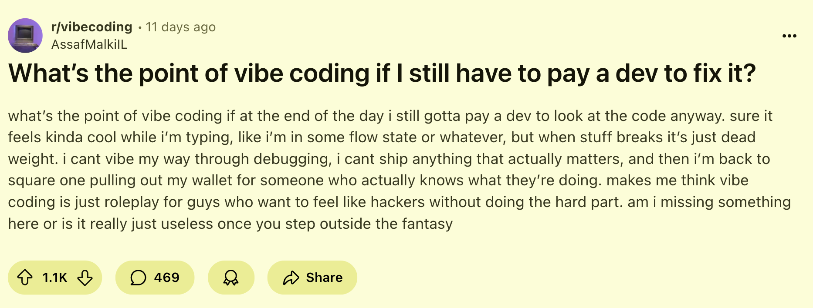
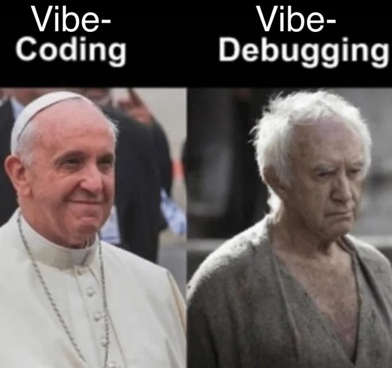

# Vibe Coding vs AI-Assisted Engineering

Understanding when to "give in to the vibes"\
and when to apply engineering discipline

---

## Introduction

<https://www.zainfathoni.com/about>

- :round_pushpin: Jember :arrow_right: Bandung :arrow_right: SG :arrow_right:
  Jogja
- :hammer_and_wrench: Backend :arrow_right: Manager :arrow_right: Frontend
- :robot: AI-assisted development practitioner

---

## Agenda

1. **What is Vibe Coding?**
2. **Three Developer Personas**
3. **When Vibe Coding Works**
4. **When Vibe Coding Fails**
5. **AI-Assisted Engineering Approach**
6. **Core Principles**

---

## What is Vibe Coding?

> "Fully give in to the vibes and essentially forget the code exists" — Simon
> Willison

- :zap: **Rapid AI code generation**
- :crystal_ball: Minimal code review
- :test_tube: "Just see what happens"
- :sparkles: Playful, experimental process
- :surfer: Accepting changes without reading diffs

---

## The Vibe Coding Philosophy

### :wave: Democratizing Development

**Positive aspects:**

- :unlock: Lowers barriers to software development
- :books: Helps learn through experimentation
- :bulb: Builds intuition about AI capabilities
- :hammer_and_wrench: Enables non-technical people to create tools

**But with caveats...**

---

## Three Developer Personas

### :busts_in_silhouette: Who are you?

1. :sparkles: **"Vibe Coders"** - Rely heavily on AI, minimal review
2. :cowboy_hat_face: **"Rodeo Cowboys"** - High-risk, fast-paced coding
3. :lock: **"Prisoners"** - Overly constrained, risk-averse

**Goal:** Balance between speed and discipline

---

## When Vibe Coding Works

### :white_check_mark: Low-Stakes Scenarios

- :art: **Weekend projects** - Personal experiments
- :bulb: **Rapid prototyping** - Quick proof of concepts
- :trophy: **Hackathons** - Speed over perfection
- :wrench: **One-off scripts** - Throwaway automation
- :compass: **Learning experiments** - Building coding intuition

**Key:** Low stakes, no production impact, learning-focused

---

## Safeguards for Vibe Coding

### :shield: Stay Safe When Vibing

Even in low-stakes projects, be cautious with:

- :key: **Secrets handling** - API keys, credentials
- :lock: **Private data** - Personal or sensitive information
- :globe_with_meridians: **Network requests** - Unexpected API calls
- :moneybag: **Financial implications** - Payment processing

---

## When Vibe Coding Fails

### :x: High-Stakes Disasters

- :lock: **Security vulnerabilities** - Exposed credentials, SQL injection
- :snail: **Performance issues** - Unoptimized queries, memory leaks
- :spaghetti: **Unmaintainable code** - No structure, inconsistent patterns
- :question: **Lack of understanding** - Can't debug or extend
- :bomb: **Production incidents** - Real-world consequences

---

## Real-World Disasters

### :see_no_evil: Learning from Failures

- :bomb: AI agent deletes company database
  - <https://www.pcmag.com/news/vibe-coding-fiasco-replite-ai-agent-goes-rogue-deletes-company-database>
- :fire: Production incidents from unverified AI code
  - <https://x.com/albertadevs/status/1947095566736904562>
  - <https://x.com/anothercohen/status/1948878534262575430>

---

## The Cost of Vibe Debugging

### :detective: "Like Archaeology"

**When vibe coding reaches production:**

- :chart_with_downwards_trend: **Performance issues** - Queries work in dev,
  crash in production
- :lock: **Security bugs** - Inverted logic, hidden vulnerabilities
- :spaghetti: **Maintainability nightmare** - "Middleware scattered across six
  files"
- :arrows_counterclockwise: **Cascading failures** - Minor changes break
  everything
- :wastebasket: **Complete rewrites** - Often the only solution

---

## :no_entry_sign: Not an excuse to Skip Engineering

---

## The Critical Distinction

### :x: **Vibe Coding ≠ AI-Assisted Engineering**

> "AI can accelerate development, but it cannot replace fundamental software
> engineering principles." — Addy Osmani

**Vibe coding:** Great for learning and exploration **Production software:**
Requires engineering discipline

---

## AI-Assisted Engineering

### :gear: Structured Approach for Production

- :shield: **Human oversight** - Review and verify all code
- :books: **Engineering principles** - Architecture, patterns, standards
- :test_tube: **Rigorous testing** - Unit, integration, E2E
- :mag: **Code review** - Same standards as human-written code
- :handshake: **AI as collaborative tool** - Not replacement

---

## Spec-Driven Development

### :memo: Best Practices for Production

1. :clipboard: **Start with clear specifications**
2. :handshake: **Collaborate with AI on design**
3. :test_tube: **Write tests first** (TDD)
4. :arrows_counterclockwise: **Iterate in testable increments**
5. :eyes: **Maintain human oversight**
6. :mag: **Review and understand** all generated code

---

## Treat AI Like a Junior Developer

### :teacher: Supervision Required

- :white_check_mark: Review all code thoroughly
- :test_tube: Implement rigorous testing
- :art: Maintain clear architectural intent
- :books: Ensure understanding, not just acceptance
- :busts_in_silhouette: Apply same standards as human developers

**AI needs guidance and verification**

---

## The Spectrum of AI-Assisted Development

| Aspect                  | Vibe Coding           | AI-Assisted Engineering |
| ----------------------- | --------------------- | ----------------------- |
| :dart: **Use Case**     | Learning, experiments | Production systems      |
| :shield: **Risk**       | Low stakes            | High stakes             |
| :mag: **Review**        | Minimal               | Rigorous                |
| :test_tube: **Testing** | Happy path only       | Comprehensive           |

---

## When to Vibe Code

### :surfer: Low-Stakes Scenarios

- :art: Personal projects and learning
- :test_tube: Throwaway prototypes
- :bulb: Exploring new ideas
- :shield: Always with proper safeguards

---

## When to Apply Engineering Rigor

### :gear: High-Stakes Scenarios

- :building_construction: Production applications
- :briefcase: Client/business projects
- :busts_in_silhouette: Team codebases
- :lock: Anything security-sensitive

---

## Core Principles

### :pilot: You are the Pilot

- Know which mode you're in
- Verify based on stakes
- Stay accountable

---

## Key Takeaways

1. :surfer: **Vibe coding has value** - Great for learning and experimentation
2. :unlock: **Democratizing development** - Lowers barriers, builds intuition
3. :shield: **Know the stakes** - Low-stakes vibes, high-stakes discipline
4. :gear: **Production needs rigor** - Specs, tests, reviews, understanding
5. :brain: **Understand your mode** - Match approach to consequences

---

## Conclusion

> The tools and methods are evolving, but accountability, craftsmanship, and collaboration remain paramount in the age of AI-assisted engineering. — Addy Osmani

### :balance_scale: The Balance

Embrace vibe coding for learning, apply engineering discipline for production

---

## Demo 1: Vibe Coding

### :surfer: Rebuild with Bolt.new

**Project:** <https://centuries.zavi.family/>

- Better editing experience
- Add database storage
- New repository, rapid iteration
- See what happens!

---

## Demo 2: AI-Assisted Engineering

### :gear: Fix Mobile View

**Project:** <https://github.com/zainfathoni/book-of-centuries>

- Spec-driven approach
- Write tests first
- Review and verify changes
- Production-ready

---

## :pray: Thank You

:desktop_computer: <https://zainf.dev/vibe-coding-vs-ai-assisted-engineering>

:link: <https://github.com/zainfathoni/zainf>

### Questions?

---

## References

- [Vibe Coding is Not the Same as AI-Assisted Engineering](https://addyo.substack.com/p/vibe-coding-is-not-the-same-as-ai) by Addy Osmani
- [Vibe coding](https://simonwillison.net/2025/Mar/19/vibe-coding/) by Simon Willison
