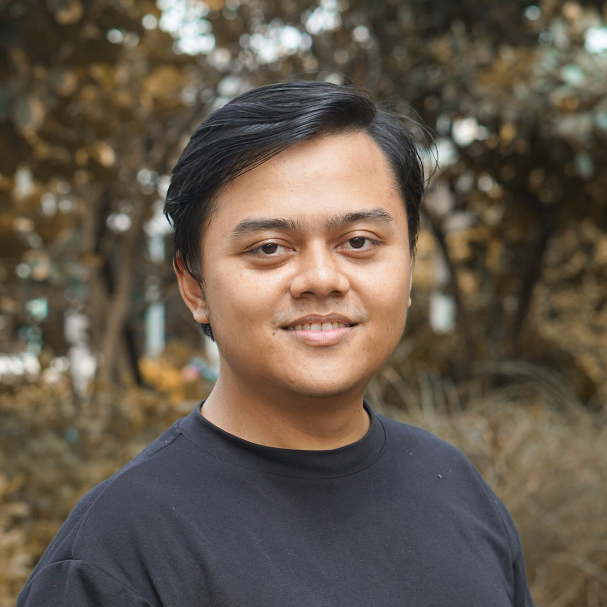

# You don't need CLI

Let the model drive the terminal. Let an Orb host it.

<h3 class="signature">Zain Fathoni</h3>

Senior Software Engineer based in Yogyakarta, Indonesia. Previously backend, manager, frontend, now fullstack.

Community builder (Ketua [VibeFromCafe.id](https://vibefromcafe.id)) · Agentic Engineering Practitioner.

<https://zainfathoni.com>

<!--
P1 — Who & What / Clarity.
The title is a provocation on purpose. The claim: YOU don't need the CLI anymore.
The CLI itself is alive and well — the model operates it for you, and it doesn't even run on your laptop.
-->

---

P2 · Common Ground

## The terminal used to be a rite of passage

We learned `git`, `ssh`, `grep`, `docker`, and a hundred flags we still Google.

Terminal fluency felt like **proof you were a real engineer.**

$ git rebase -i HEAD~3 
$ docker compose up -d 
$ gh pr create --fill 
$ pnpm run typecheck 
$ man tar # again

Everyone in this room has typed these. Most of us still look up the flags.

<!--
P2 — Common Ground: we all paid our dues in the terminal.
Get nods first. Ask: "Who here has Googled the tar flags more than once?" Establish that CLI skill was a badge.
-->

---

P3 · Coming Problem

## Your laptop became the bottleneck

Every tool ships a CLI. Every agent wants a checkout, a port, a browser.

Run three agents locally and you're babysitting **worktrees, conflicting processes, and fans at full speed.**

Thorsten Ball · 4 August 2026

<blockquote>

Now that I don't have to worry about any of this — not how many checkouts I have … or whether there's processes conflicting or ports being already open — I spawn so many more agents.

</blockquote>

“What I Want to Tell You About Orbs” <a href="https://ampcode.com/notes/what-i-want-to-tell-you-about-orbs">ampcode.com/notes/what-i-want-to-tell-you-about-orbs</a>

<!--
P3 — Coming Problem: the local machine is the ceiling.
The friction isn't typing commands — it's the local environment. Checkouts, dirty worktrees, port clashes.
Thorsten admits he'd have told you to "git good" two months earlier. The friction was invisible until it was gone.
-->

---

P4 · Emotional Win

## Imagine closing your laptop early

You describe the outcome. The agent does the work somewhere else.

You come back to **proof**, not a pile of terminal output.

<blockquote>

It didn't take up anything! No checkout, no ports, no browser, nothing!

</blockquote>

Thorsten Ball, after an agent ran 8–30 minutes testing its own work — while his phone was back in his pocket.

<!--
P4 — Emotional Win: work keeps moving while you walk away.
Paint the feeling: laptop closed, phone in pocket, agent still testing. That's the promise.
-->

---

P5 · False Hope

## “I just need a better terminal setup”

More tmux panes. More worktrees. Sharper dotfiles. A faster laptop.

It helps — until **one machine** is running every agent, every server, and you.

<strong>🪟 More panes</strong>

More agents to watch, not fewer things to do.

<strong>🌳 More worktrees</strong>

More checkouts to create, sync, and clean up.

<strong>💻 Bigger laptop</strong>

Same ceiling, just higher. Still one machine.

<!--
P5 — False Hope: optimize the local terminal harder.
Confession: I did exactly this — tmux + worktrees + runner scripts. It works, and it still caps out.
Sobering reality: you are scaling yourself as the operator, not removing the operator role.
-->

---

P6 · Audacious Reality

## You don't need CLI

Models already read `--help`, run the commands, and parse the output better than we do.

**Amp** is the vessel. **Orbs** are where it lives: parallel, isolated, ephemeral cloud sandboxes.

Amp team · Alex Kemper · 10 August 2026

85%

of Amp's own commits now come from Orbs — and their commit velocity rose 65% in the month since Orbs shipped. — <a href="https://ampcode.com/notes/pave-the-road">Pave the Road</a>

<!--
P6 — Audacious Reality: stop operating the CLI yourself.
The CLI doesn't disappear. It becomes the model's interface, not yours.
Be honest about the source: these are Amp's own numbers about their own team, not an industry survey.
Kemper: "Local dev isn't dead yet, but the family has gathered around the bed."
-->

---

P7 · We Can Do This

## Three shifts, no new commands

You already have every skill this needs.

You're trading **typing commands** for **stating intent and judging proof.**

<strong>🗣️ State the outcome</strong>

“Open a PR that fixes the broken footer link” — not the <code>git</code> incantation.

<strong>🫧 Move off your laptop</strong>

Spawn it in an Orb. No checkout, no ports, no fans.

<strong>🧾 Demand proof</strong>

Tests, screenshots, a video. Review evidence, not transcripts.

<!--
P7 — We Can Do This: the shifts are about what you ask for, not what you learn.
Thorsten's prompt, verbatim: "I want you to give me 100% proof that what you did works.
Test this end to end. In many ways. Run through a matrix of test cases."
-->

---

P8 · Call To Action

## Tonight: spawn one Orb

<ol class="small-list">
<li>Sign in at <strong>ampcode.com</strong></li>
<li>Start an agent in an Orb on a repo you own</li>
<li>Give it one real papercut, in plain language</li>
<li>Ask for proof it works, then close the tab</li>
<li>While it runs, spawn a second one</li>
</ol>

<blockquote>

Every time I see a papercut I take a screenshot, start an agent in an orb and let it rip.

</blockquote>

Thorsten Ball — the habit to steal.

<!--
P8 — Call To Action: one Orb, one papercut, tonight.
Keep it tiny: a typo, a flaky test, a broken link. The point is to feel the friction disappear.
Step 5 is the real lesson — parallelism is free once your laptop isn't the host.
-->

---

P9 · Early Benefits

## What you get back this week

- no local setup, no port clashes
- more agents running in parallel
- steering from web, phone, or desktop
- a lighter review load, because agents bring proof

<strong>Instead of:</strong>

one agent, one terminal, you watching every line scroll by.

<strong>You get:</strong>

several agents in several Orbs, each returning with screenshots, test runs, or a demo video.

<!--
P9 — Early Benefits: measurable wins in days, not months.
Thorsten's list: "more agents building more complicated things; agents running for longer and giving
better proof that what they did works; a lighter, less sigh-inducing review load".
-->

---

P10 · Long Win

## The terminal becomes plumbing

Like assembly: still there, still essential, rarely typed by hand.

Engineers spend their time on **what to build and whether it works** — not on how to invoke it.

Thorsten Ball · 4 August 2026

<blockquote>

There's basically very very few things left that require a local dev environment.

</blockquote>

“… the next big change, a bigger change possibly than coding agents themselves.”

<!--
P10 — Long Win: the operator role fades, the judgment role grows.
Tie back to the SWE Growth theme: growth now means sharper intent and better review, not more flags memorized.
Caveat to say out loud: you still need to READ what the agent ran. Not needing to type it ≠ not needing to understand it.
-->

---

# Live Demo

Zero commands typed by me. For as long as the room wants.

🙋 You pick the tasks. The agents run the CLI. We judge the proof.

<!--
Section break. ~10 minutes of slides done; now up to 2 hours of live demo.
Energy shift: take hands off the keyboard — literally.
-->

---

## How the demo works

<ol class="small-list">
<li><strong>Spawn</strong> (15 min) — first Orb on this very website's repo</li>
<li><strong>Pick</strong> (15 min) — you shout papercuts, we vote on three</li>
<li><strong>Fan out</strong> (30 min) — one Orb per task, running in parallel</li>
<li><strong>Proof</strong> (30 min) — review screenshots, tests, videos together</li>
<li><strong>Ship</strong> (30 min) — the agent opens the PR; we decide to merge</li>
</ol>

Each round stands alone. We can stop after any of them.

<strong>Ground rule:</strong>

I won't type a single shell command. If something needs a CLI, the agent runs it.

<strong>Backup plan, if the room is shy:</strong>

Build this deck's PDF and og-image in an Orb, then list the talk on <a href="https://zainfathoni.com/talks">zainfathoni.com/talks</a>.

<!--
Demo agenda. Timebox each round out loud; drop rounds 4–5 if time runs short.
Keep a list of 3–5 real papercuts in this repo ready in case nobody volunteers.
Steer at least one Orb from the phone to prove the "no laptop" point.
-->

---

## CLIs we'll watch the agent run

The commands don't disappear. They just stop being my job:

- `git` / `gh` — branches, commits, pull requests
- `pnpm` — install, typecheck, build
- `playwright` — browser proof
- `marp` — slides, like these ones

# typed by the agent, not me 
$ pnpm install 
$ pnpm run typecheck ✓ 
$ gh pr create --fill ✓

Watch the transcript, not the keyboard.

<!--
Anatomy slide — point at each CLI as the agent invokes it during the demo.
The argument of the talk is visible here: the terminal is busy, and nobody in the room is typing into it.
-->

---

## References

- Thorsten Ball — [What I Want to Tell You About Orbs](https://ampcode.com/notes/what-i-want-to-tell-you-about-orbs) (4 August 2026)
- Alex Kemper — [Pave the Road](https://ampcode.com/notes/pave-the-road) (10 August 2026)
- [Amp](https://ampcode.com) — the coding agent used in the demo
- Dan Roam — [The Pop-Up Pitch](https://www.danroam.com/) (this talk's storyline)
- Zain Fathoni — [Fundamental CS for AI Era](https://www.zainfathoni.com/fundamental-computer-science-ai-era.html)

<blockquote>

Stop operating the terminal.

Start judging the proof.

</blockquote>

<!--
Reference slide. The Fundamental CS talk is the counterweight: not typing commands still requires understanding them.
-->

---

# Q & A

<a href="https://www.zainfathoni.com/you-dont-need-cli.html">zainfathoni.com/you-dont-need-cli.html</a>

<a href="https://ampcode.com">ampcode.com</a>

Zain Fathoni

